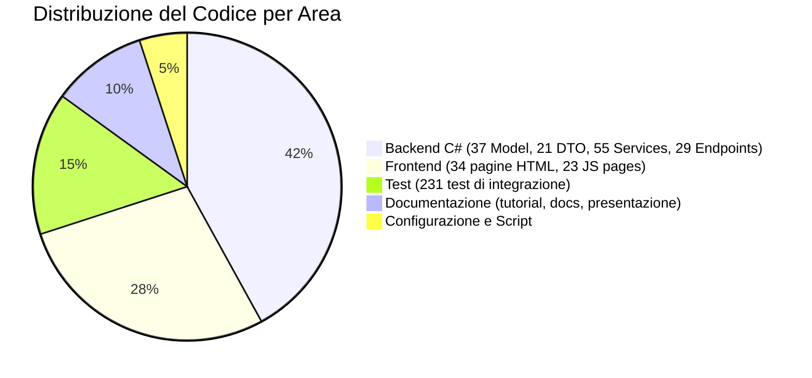
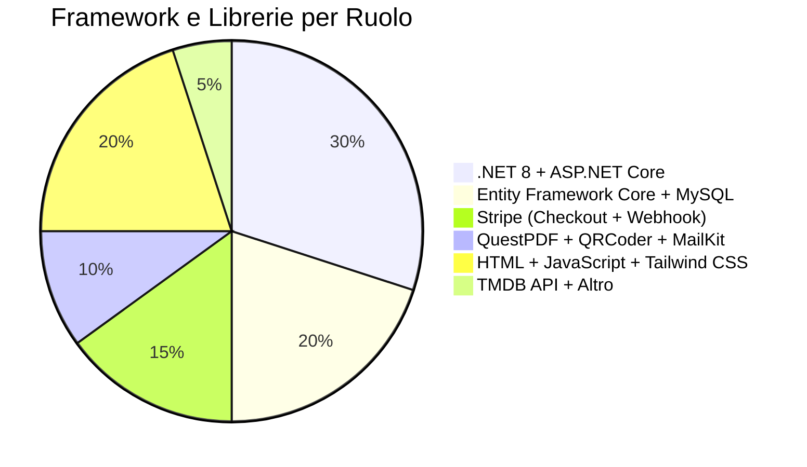
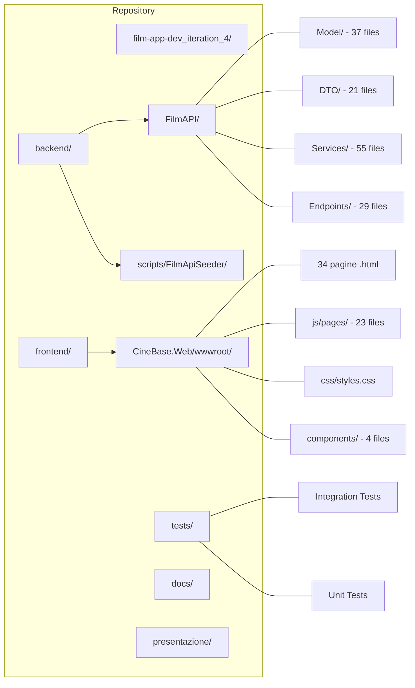

# CineBase — Presentazione del Sistema

> **Piattaforma Web per la Gestione di Cinema Multisala e Ticketing Digitale**
> Versione: Iterazione 4 | Stack: .NET 8 + MySQL + Tailwind CSS + Stripe

---

## Indice dei Documenti

| # | Documento | Pagine | Diagrammi | Tabelle | Argomento Principale |
|---|---|---|---|---|---|
| **00** | `00-indice.md` | — | — | 3 | Indice generale, legenda, statistiche progetto |
| **01** | `01-architettura.md` | — | 3 | 8 | Stack, componenti, pipeline richieste, design system |
| **02** | `02-modello-dati.md` | — | 4 | 8 | Entità, relazioni, enumerazioni, migration |
| **03** | `03-autenticazione.md` | — | 4 | 7 | JWT, refresh token, RBAC, route guard, 2FA |
| **04** | `04-programmazione.md` | — | 4 | 6 | Catalogo film, scheda, cinema preferito, tabs |
| **05** | `05-acquisto-biglietti.md` | — | 5 | 6 | Seat-map, hold, countdown, zoom, validazione |
| **06** | `06-pagamenti.md` | — | 5 | 6 | Stripe Checkout, credito, misto, webhook |
| **07** | `07-ticketing.md` | — | 3 | 7 | Biglietti PDF, email, QR code, validazione |
| **08** | `08-admin.md` | — | 3 | 7 | CRUD, shell admin, paginazione, utenti |
| **09** | `09-seed-dati.md` | — | 2 | 7 | FilmApiSeeder, TMDB, cinema, sale |
| **10** | `10-test.md` | — | 4 | 6 | 231 test, distribuzione, fakes, evoluzione |

---

## Legenda Diagrammi Mermaid

Tutti i diagrammi in questi documenti usano [Mermaid](https://mermaid.js.org/) e sono visualizzabili in GitHub, VS Code con estensione, o qualsiasi Markdown viewer compatibile.

| Tipo | Codice | Utilizzo |
|------|--------|----------|
| Diagramma di flusso | `flowchart TD` | Processi operativi, flussi di navigazione |
| Grafo relazionale | `graph LR` | Architettura, dipendenze tra componenti |
| Diagramma UML classi | `classDiagram` | Entità e relazioni del modello dati |
| Diagramma di sequenza | `sequenceDiagram` | Interazioni temporali tra componenti |
| Macchina a stati | `stateDiagram-v2` | Cicli di vita di entità (ordine, biglietto) |
| Grafico a torta | `pie` | Distribuzioni percentuali |
| Diagramma Gantt | `gantt` | Timeline e pianificazione temporale |

---

## Statistiche Generali del Progetto

---

## Stack Tecnologico Riepilogativo

| Livello | Tecnologia | Versione | Ruolo |
|---------|-----------|----------|-------|
| Backend linguaggio | C# | 12.0 (.NET 8) | Logica applicativa, API REST |
| Backend framework | ASP.NET Core | 8.0 | Web framework, middleware, routing |
| Backend ORM | Entity Framework Core | 8.0 | Object-Relational Mapping per MySQL |
| Database | MySQL | 8.0 | Database relazionale |
| Frontend | HTML5 + JavaScript ES6 | — | Interfaccia utente lato browser |
| Frontend CSS | Tailwind CSS | 3.x | Framework CSS utility-first |
| Design system | Google Stitch | — | Token di design, palette colori |
| Pagamenti | Stripe | — | Checkout Session hosted, webhook |
| PDF | QuestPDF | 2024.x | Generazione PDF multipagina |
| QR Code | QRCoder | 1.x | Generazione codici QR |
| Barcode | ZXing.Net | 0.16.x | Barcode grafico per biglietti |
| Email | MailKit | — | Invio email SMTP |
| Provider SMTP | Google SMTP / Twilio SendGrid | — | Servizi di invio email |
| Dati film | TMDB API v3 | — | Importazione film, cast, copertine |
| Test | xUnit + Microsoft.AspNetCore.TestHost | — | Test di integrazione |
| Autenticazione | JWT (JSON Web Token) | — | Auth stateless |

---

## Mappa del Repository

