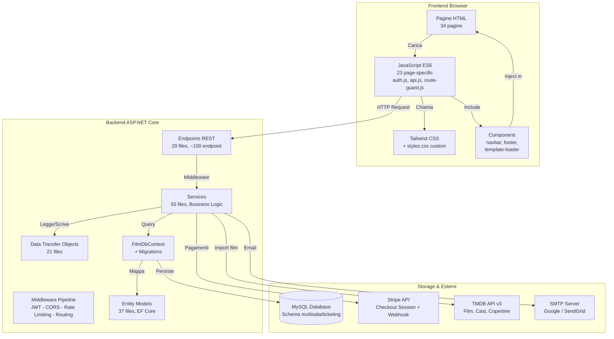
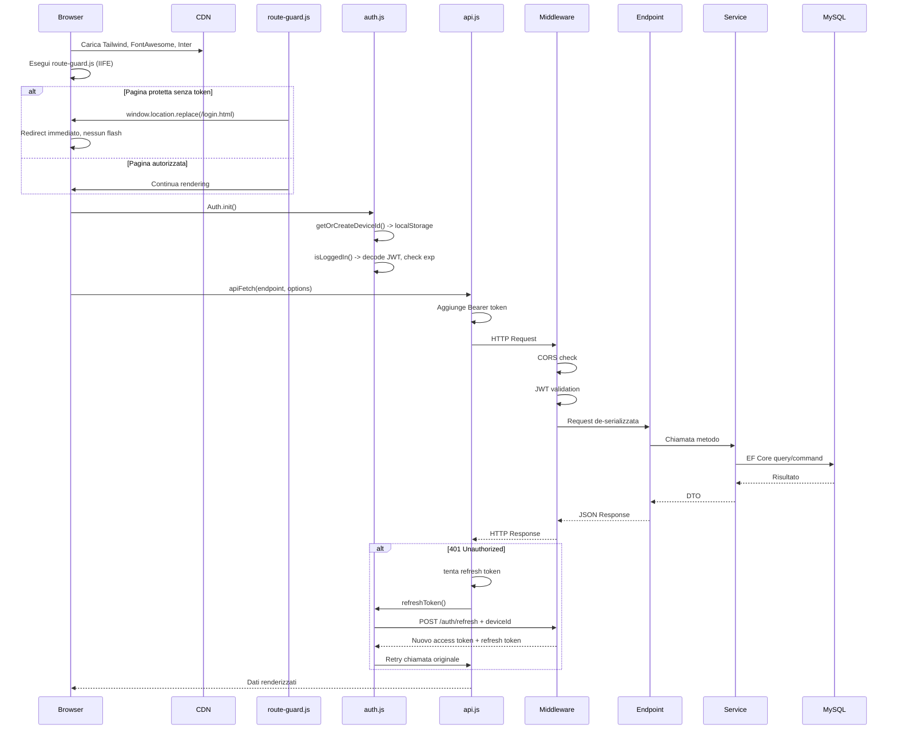
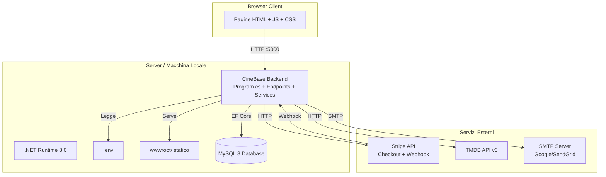
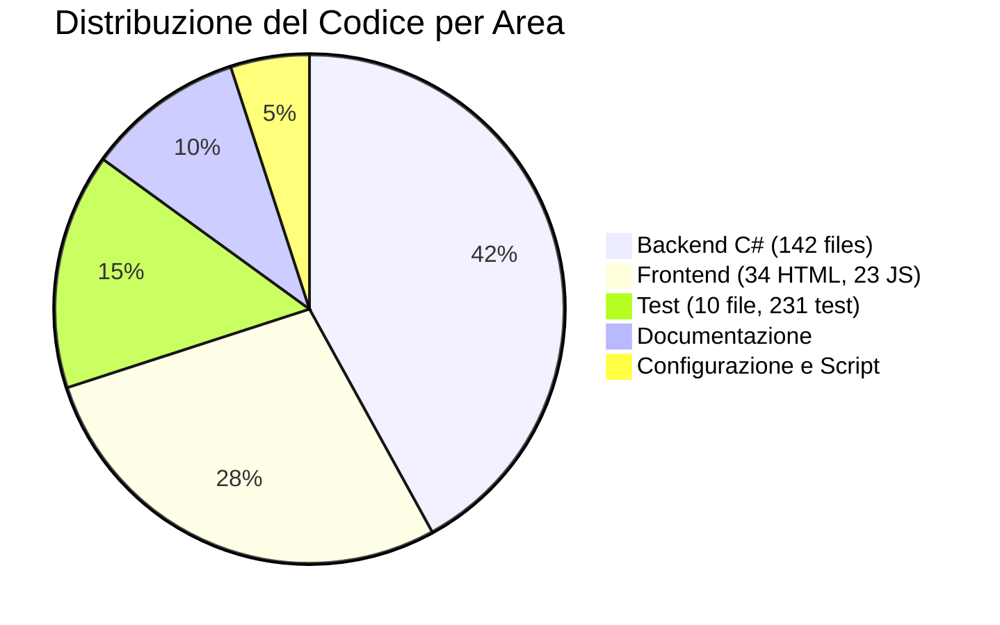
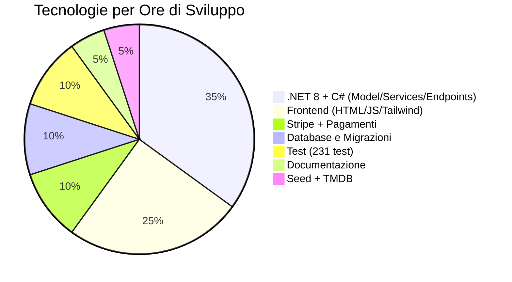

# Architettura del Sistema

## Stack Tecnologico Dettagliato

### Backend

| Tecnologia | Versione | Utilizzo |
|------------|----------|----------|
| .NET SDK | 8.0 | Runtime e toolchain |
| C# | 12.0 | Linguaggio di programmazione |
| ASP.NET Core | 8.0 | Web framework, pipeline middleware |
| Entity Framework Core | 8.0 | ORM per accesso al database |
| Pomelo.EntityFrameworkCore.MySql | 8.x | Provider MySQL per EF Core |
| QuestPDF | 2024.x | Generazione PDF multipagina per biglietti |
| QRCoder | 1.x | Generazione codici QR |
| ZXing.Net | 0.16.x | Generazione barcode grafico |
| MailKit | 4.x | Client SMTP per invio email |
| Stripe.net | — | SDK per integrazione Stripe |
| BCrypt.Net | — | Hashing delle password |
| System.IdentityModel.Tokens.Jwt | — | Creazione e validazione JWT |

### Frontend

| Tecnologia | Versione | Utilizzo |
|------------|----------|----------|
| HTML5 | — | Struttura pagine (34 pagine) |
| JavaScript ES6 | — | Logica client-side |
| Tailwind CSS | 3.x | Framework CSS utility-first |
| Font Awesome | 6.x | Icone vettoriali |
| Google Fonts (Inter) | — | Tipografia principale |
| Stripe.js | — | Redirect a Checkout hosted |

### Infrastruttura

| Componente | Tecnologia | Ruolo |
|------------|-----------|-------|
| Database | MySQL 8 | Persistenza dati relazionali |
| Pagamenti | Stripe Checkout | Pagamenti hosted con carta |
| Email | Google SMTP / Twilio SendGrid | Invio biglietti via email |
| Dati film | TMDB API v3 | Importazione film, cast, copertine |
| Design | Google Stitch | Design system tokens |

---

## Architettura Generale



---

## Pipeline Richiesta HTTP



---

## Struttura dei Progetti

```
film-app-dev_iteration_4/
│
├── backend/
│   ├── FilmAPI/
│   │   ├── Program.cs              # Entry point, middleware, DI
│   │   ├── Model/                  # 37 file: entità EF Core
│   │   │   ├── Film.cs, Cinema.cs, Sala.cs
│   │   │   ├── Show.cs, ShowPostoStato.cs
│   │   │   ├── Ordine.cs, Biglietto.cs
│   │   │   ├── User.cs, MovimentoCredito.cs
│   │   │   ├── Categoria.cs, Regista.cs
│   │   │   └── 6 enum files
│   │   ├── DTO/                    # 21 file
│   │   ├── Services/               # 55 file
│   │   ├── Endpoints/              # 29 file, ~100 endpoint
│   │   ├── Data/                   # DbContext, Seed
│   │   └── Migrations/             # EF Core migrations
│   └── scripts/FilmApiSeeder/      # Seeder standalone
│
├── frontend/CineBase.Web/wwwroot/
│   ├── 34 pagine HTML
│   ├── js/ (auth.js, api.js, route-guard.js, 23 pages/)
│   ├── css/styles.css
│   └── components/ (navbar, footer)
│
├── tests/backend/FilmAPI.Tests/
│   ├── Integration/                # 10 file di test
│   └── Unit/                       # Test legacy
│
├── docs/, presentazione/
```

---

## Blocchi di Codice Commentati

### Pattern: Endpoint REST con ASP.NET Core Minimal API

```csharp
// backend/FilmAPI/Endpoints/CheckoutEndpoints.cs
// Pattern: Minimal API con dependency injection e auth

public static void MapCheckoutEndpoints(this WebApplication app)
{
    // Raggruppo tutti gli endpoint checkout sotto /checkout
    var checkout = app.MapGroup("/checkout");

    // Endpoint protetto: richiede autenticazione
    // Il middleware JWT estrae user ID dal token automaticamente
    checkout.MapGet("/orders", async (HttpContext ctx, ICheckoutService svc) =>
    {
        // Legge UserId dal claim "sub" del JWT
        var userId = int.Parse(ctx.User.FindFirst("sub")!.Value);

        // Chiama il service che fa la query al DB
        var ordini = await svc.GetOrdiniByUserAsync(userId);

        // Restituisce JSON automaticamente
        return Results.Ok(ordini);
    })
    .RequireAuthorization("Authenticated");  // GATE: solo utenti loggati
}
```

### Pattern: Middleware Pipeline ASP.NET Core

```csharp
// backend/FilmAPI/Program.cs
// Pattern: pipeline middleware con configurazione

var builder = WebApplication.CreateBuilder(args);

// 1. REGISTRAZIONE SERVIZI (Dependency Injection)
builder.Services.AddDbContext<FilmDbContext>(options =>
    options.UseMySql(connectionString, ServerVersion.AutoDetect(connectionString)));

builder.Services.AddScoped<IFilmService, FilmService>();      // Nuova istanza per richiesta
builder.Services.AddScoped<ICheckoutService, CheckoutService>();
builder.Services.AddHostedService<ExpiredHoldCleanupService>(); // Background service

// 2. AUTENTICAZIONE JWT
builder.Services.AddAuthentication().AddJwtBearer(options =>
{
    options.TokenValidationParameters = new TokenValidationParameters
    {
        ValidateIssuerSigningKey = true,
        IssuerSigningKey = new SymmetricSecurityKey(secretKey),
        ValidateLifetime = true,           // Scadenza token
        ClockSkew = TimeSpan.Zero          // Nessun margine
    };
});

// 3. AUTORIZZAZIONE RBAC
builder.Services.AddAuthorization(options =>
{
    options.AddPolicy("Authenticated", p => p.RequireAuthenticatedUser());
    options.AddPolicy("AdminOnly", p => p.RequireRole("Admin"));
    options.AddPolicy("PowerUserOrAdmin", p => p.RequireRole("PowerUser", "Admin"));
});

var app = builder.Build();

// 4. MIDDLEWARE PIPELINE (ordine IMPORTANTE)
app.UseCors();              // 1. Permetti richieste cross-origin
app.UseAuthentication();    // 2. Chi sei? (legge JWT)
app.UseAuthorization();     // 3. Cosa puoi fare? (RBAC)

// 4. MAPPATURA ENDPOINT
app.MapAuthEndpoints();
app.MapCheckoutEndpoints();
app.MapProgrammazioneEndpoints();

app.Run();
```

## Design System Ferrari-inspired

### Palette Colori

| Token | Valore | Utilizzo |
|-------|--------|----------|
| `canvas` | `#181818` | Sfondo pagina, near-black |
| `canvas-elevated` | `#303030` | Card e pannelli su sfondo scuro |
| `canvas-light` | `#ffffff` | Bande editoriali chiare |
| `primary` (Rosso Corsa) | `#da291c` | CTA primari, accenti |
| `ink` | `#ffffff` | Testo su sfondo scuro |
| `body` | `#969696` | Testo corpo su sfondo scuro |
| `hairline` | `#303030` | Divider 1px su sfondo scuro |
| `semantic-success` | `#03904a` | Stato pagato, successo |
| `semantic-warning` | `#f13a2c` | Warning, errori |

### Tipografia

| Token | Size | Weight | Uso |
|-------|------|--------|-----|
| `display-mega` | 80px | 500 | Hero homepage |
| `display-xl` | 56px | 500 | Hero secondari |
| `display-lg` | 36px | 500 | Sezioni |
| `display-md` | 26px | 500 | Sotto-sezioni |
| `title-md` | 18px | 700 | Titoli componenti |
| `body-md` | 14px | 400 | Testo corpo |
| `button` | 14px | 700 | CTA, uppercase, tracking 1.4px |

### Principi Fondamentali

| Principio | Descrizione |
|-----------|-------------|
| Singolo accento | Rosso Corsa usato con parsimonia su CTA primari |
| Angoli vivi | 0px su ogni CTA e card |
| CTA uppercase | 1.4px tracking su tutti i pulsanti |
| Display weight 500 | Mai bold |
| Nessun drop shadow | Profondità fotografica |
| Scala 8px | 4/8/16/24/32/48/64/96/128px |
| Light/dark mode | Supporto completo |

---

## Endpoint per Area Funzionale

| Area | Endpoint | File |
|------|----------|------|
| Autenticazione | 12 | `AuthEndpoints.cs`, `SocialAuthEndpoints.cs` |
| Programmazione | 7 | `ProgrammazioneEndpoints.cs` |
| Film, registi, categorie | 15 | `FilmsEndpoints.cs`, `RegistiEndpoints.cs`, `CategorieEndpoints.cs` |
| Cinema e sale | 12 | `CinemasEndpoints.cs`, `SaleEndpoints.cs` |
| Show e proiezioni | 10 | `ShowsEndpoints.cs`, `ProiezioniEndpoints.cs` |
| Checkout e acquisto | 10 | `CheckoutEndpoints.cs` |
| Pagamento e credito | 8 | `PagamentoEndpoints.cs`, `CreditoEndpoints.cs` |
| Ticketing e validazione | 3 | `ValidazioneBigliettiEndpoints.cs` |
| Profilo e utenti | 10 | `ProfiloEndpoints.cs`, `AdminUtentiEndpoints.cs` |
| Media e TMDB | 4 | `MediaEndpoints.cs`, `TmdbEndpoints.cs` |
| Altre (offerte, notifiche, etc.) | 10 | Varie |
| **Totale** | **~100** | **29 files** |

---

## Diagramma di Deployment



---

## Distribuzione del Codice




