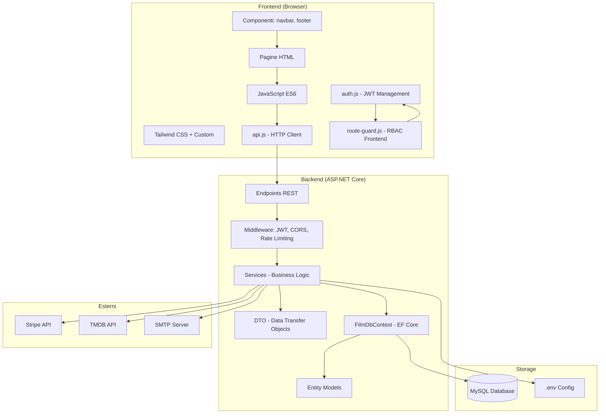
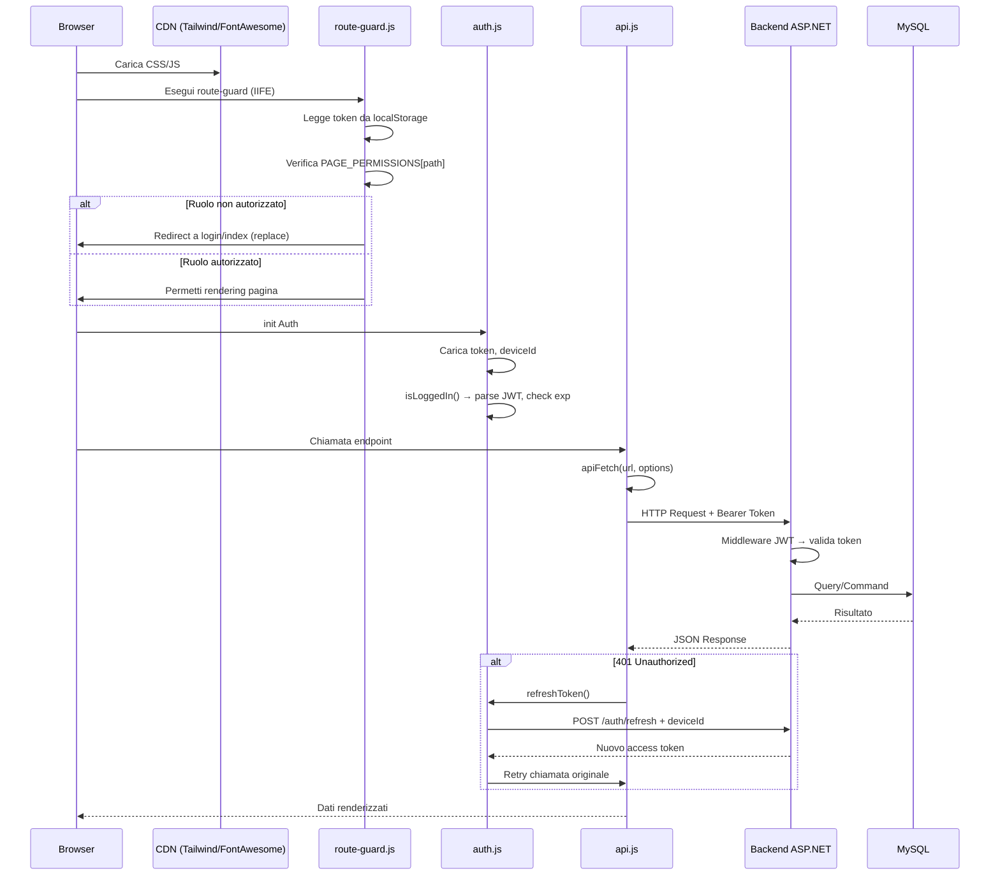

# Architettura del Sistema

## Stack Tecnologico Dettagliato

| Livello | Tecnologia | Versione | Ruolo |
|---------|-----------|----------|-------|
| **Backend** | .NET (C#) | 8.0 | API REST, business logic, ORM |
| **Backend** | ASP.NET Core | 8.0 | Web framework, middleware pipeline |
| **Backend** | Entity Framework Core | 8.0 | ORM per MySQL |
| **Database** | MySQL | 8.0 | Database relazionale |
| **Frontend** | HTML5 + JavaScript ES6 | - | Single-page application |
| **Frontend** | Tailwind CSS | 3.x | Utility-first CSS framework |
| **Frontend** | Font Awesome | 6.x | Icone |
| **Pagamenti** | Stripe .NET SDK | - | Stripe Checkout, webhook |
| **Pagamenti** | Stripe.js | - | Frontend Stripe Checkout |
| **Ticketing** | QuestPDF | - | Generazione PDF multipagina |
| **Ticketing** | QRCoder | - | Generazione QR code |
| **Ticketing** | ZXing.Net | - | Barcode grafico |
| **Ticketing** | MailKit | - | Invio email SMTP |
| **Ticketing** | PdfPig | - | Lettura PDF nei test |
| **Design** | Google Stitch | - | Design system tokens |
| **Seed** | TMDB API | - | Dati film realistici |

---

## Architettura Generale



---

## Pipeline Richieste HTTP



---

## Struttura dei Progetti

```
film-app-dev_iteration_4/
├── backend/
│   ├── FilmAPI/                     # API principale
│   │   ├── Model/                   # Entità EF Core (37 file)
│   │   ├── DTO/                     # Data Transfer Objects (21 file)
│   │   ├── Services/                # Business logic (55 file)
│   │   ├── Endpoints/               # REST API endpoints (29 file)
│   │   ├── Data/                    # DbContext, Migration, Seeder
│   │   └── Migrations/              # EF Core migrations
│   └── scripts/
│       └── FilmApiSeeder/           # Seeder standalone
│
├── frontend/
│   └── CineBase.Web/
│       └── wwwroot/
│           ├── *.html               # 34 pagine HTML
│           ├── js/
│           │   ├── auth.js          # Gestione autenticazione
│           │   ├── api.js           # Client HTTP (617 lines)
│           │   ├── route-guard.js   # Route guard RBAC
│           │   ├── theme.js         # Tema light/dark
│           │   ├── template-loader.js # Caricamento componenti
│           │   ├── date-rail.js     # Componente rail date
│           │   └── pages/           # 23 page-specific JS
│           ├── css/
│           │   └── styles.css       # Design system tokens
│           └── components/
│               ├── navbar-landing.html
│               ├── navbar-admin.html (legacy)
│               ├── footer-landing.html
│               └── footer-admin.html
│
├── tests/
│   └── backend/
│       └── FilmAPI.Tests/
│           ├── Integration/         # Test integrazione
│           └── Unit/                # Test unitari
│
├── docs/                            # Documentazione
└── presentazione/                   #
```

---

## Design System (Ferrari-inspired)

Il design system trae ispirazione dal linguaggio visivo Ferrari con:

- **Canvas**: near-black `#181818` — mai nero puro
- **Accento primario**: Rosso Corsa `#da291c` — usato con parsimonia
- **Tipografia**: FerrariSans / Inter, display weight 500
- **Angoli**: sharp `0px` su tutti i CTA e card
- **CTA**: uppercase con tracking 1.4px
- **Spaziatura**: scala 8px (4/8/16/24/32/48/64/96/128)
- **Elevazione**: profondità fotografica, nessun drop shadow
- **Tema**: supporto completo light/dark mode

Vedi `DESIGN.md` per la specifica completa dei token di design.
