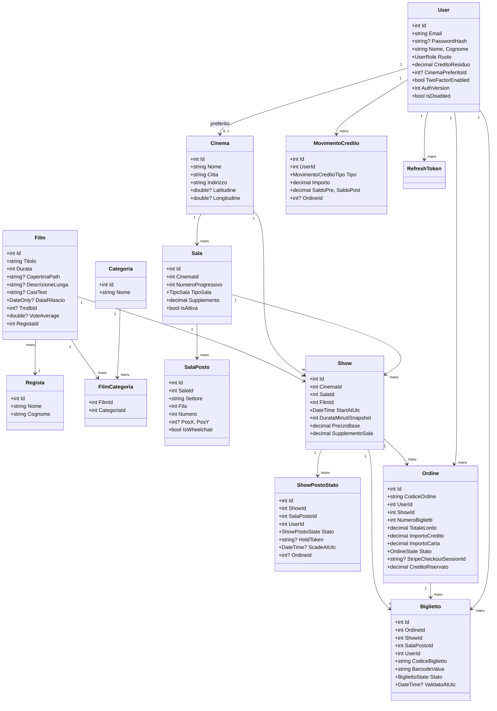
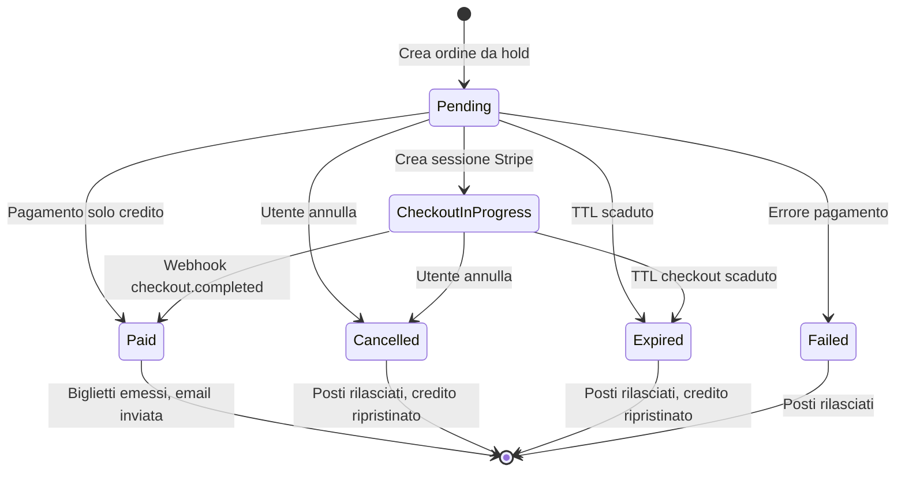
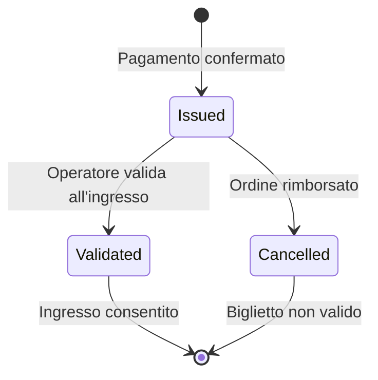

# Modello Dati

## Panoramica

Il database si basa su Entity Framework Core con MySQL. Il modello dati è suddiviso in tre domini principali e comprende **37 entità**, **6 enumerazioni** e **9 vincoli di unicità**.

---

## Tabella Riepilogativa Entità

| Dominio | Entità | Descrizione | Relazioni Chiave |
|---------|--------|-------------|-------------------|
| **Cinema Multisala** | `Film` | Film cinematografico | 1 regista, N proiezioni, N show, N categorie |
| | `Regista` | Regista film | N film |
| | `Categoria` | Categoria film | N film (many-to-many) |
| | `Cinema` | Sede cinematografica | N sale, N proiezioni, N show |
| | `Sala` | Sala all'interno del cinema | N posti, N show |
| | `SalaPosto` | Posto singolo con coordinate | 1 sala |
| | `Show` | Spettacolo programmato | 1 film, 1 cinema, 1 sala |
| | `Proiezione` | Entità legacy (da migrare) | Bridge verso Show |
| **Ticketing** | `ShowPostoStato` | Stato posto per show | Hold/Sold per utente |
| | `Ordine` | Ordine di acquisto | N biglietti, 1 user, 1 show |
| | `Biglietto` | Biglietto digitale emesso | 1 ordine, 1 posto |
| | `Prenotazione` | Entità legacy pre-ticketing | Mantenuta per compatibilità |
| **Utenti & Pagamenti** | `User` | Utente della piattaforma | N ordini, N biglietti, N refresh token |
| | `MovimentoCredito` | Transazione credito | 1 utente, opzionale 1 ordine |
| | `RefreshToken` | JWT refresh token | 1 utente, device-aware |
| | `UserExternalLogin` | Social login link | 1 utente, 1 provider |

---

## Diagramma Entità-Relazioni Completo



---

## Enumerazioni

| Enum | Valori | Valore Int | Descrizione |
|------|--------|-----------|-------------|
| `TipoSala` | DueD, TreD, ISENSE, XL | 0-3 | Tipologia sala cinematografica |
| `OrdineState` | Pending, Paid, Failed, Cancelled, Expired, CheckoutInProgress | 0-5 | Ciclo di vita dell'ordine |
| `ShowPostoState` | Hold, Sold | 0-1 | Stato posto per uno show |
| `BigliettoState` | Issued, Validated, Cancelled | 0-2 | Ciclo di vita del biglietto |
| `MovimentoCreditoTipo` | TopUp, DebitOrder, Refund, Adjustment | 0-3 | Tipo transazione credito |
| `UserRole` | User, PowerUser, Admin | 0-2 | Ruoli utente (RBAC) |

---

## Ciclo di Vita dell'Ordine



### Tabella Transizioni di Stato

| Stato Iniziale | Evento | Stato Finale | Azioni |
|----------------|--------|-------------|--------|
| (nessuno) | Utente seleziona posti + click continua | Pending | Hold token consumato, ordine creato |
| Pending | Pagamento con credito riuscito | Paid | Credito addebitato, biglietti emessi |
| Pending | Stripe Checkout avviato | CheckoutInProgress | Sessione Stripe creata, credito riservato |
| Pending | Utente clicca annulla | Cancelled | Posti rilasciati, hold rimosso |
| Pending | TTL hold superato | Expired | Cleanup automatico, posti liberati |
| CheckoutInProgress | Webhook checkout.completed | Paid | Credito riservato addebitato, biglietti emessi |
| CheckoutInProgress | Webhook checkout.expired | Expired | Rilascio posti, credito ripristinato |
| CheckoutInProgress | Utente annulla | Cancelled | Rilascio posti, credito ripristinato |

---

## Ciclo di Vita del Biglietto



---

## Indici Unici

| Tabella | Colonne | Descrizione |
|---------|---------|-------------|
| `Sala` | `(CinemaId, NumeroProgressivo)` | Unicità numero sala per cinema |
| `SalaPosto` | `(SalaId, Settore, Fila, Numero)` | Unicità posto nella sala |
| `Show` | `(CinemaId, SalaId, StartAtUtc)` | Due show non possono iniziare nello stesso momento nella stessa sala |
| `ShowPostoStato` | `(ShowId, SalaPostoId)` | Un solo stato per posto per show |
| `Ordine` | `CodiceOrdine` | Codice ordine univoco |
| `Ordine` | `IdempotencyKey` | Evita duplicati in caso di rete |

---

## Migration EF Core

| Migration | Data | Modifiche |
|-----------|------|-----------|
| InitialCreate | Iterazione 2 | Schema base: Film, Regista, Cinema, Proiezione, Prenotazione |
| AddRefreshTokenDeviceId | 2026-04-13 | Colonna DeviceId su RefreshToken per auth device-aware |
| AddMultisalaTicketing | 2026-04-16 | 7 nuove tabelle (Sala, SalaPosto, Show, ShowPostoStato, Ordine, Biglietto, MovimentoCredito) + data migration legacy |
| AddStripeCheckoutFieldsToOrdine | 2026-04-19 | Campi Stripe Checkout su Ordine (SessionId, CheckoutExpiresAt, CreditoRiservato) |

### Comandi

```bash
# Creare una migration
dotnet ef migrations add NomeMigration --project backend/FilmAPI

# Applicare al database
dotnet ef database update --project backend/FilmAPI
```
