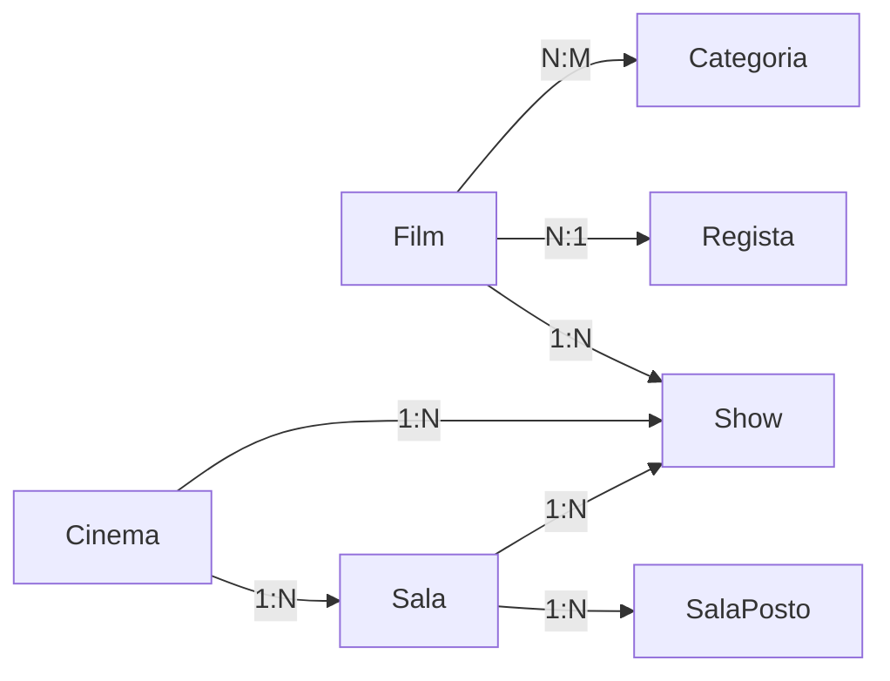
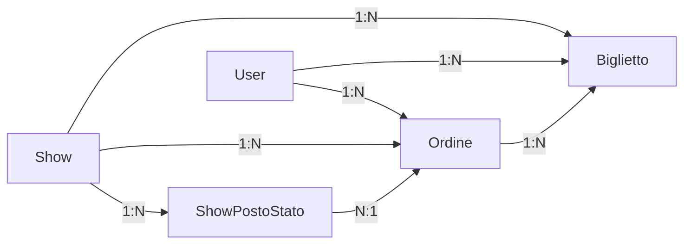
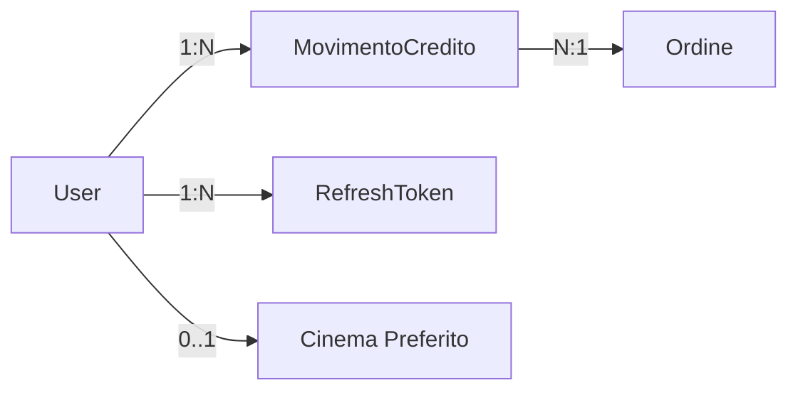
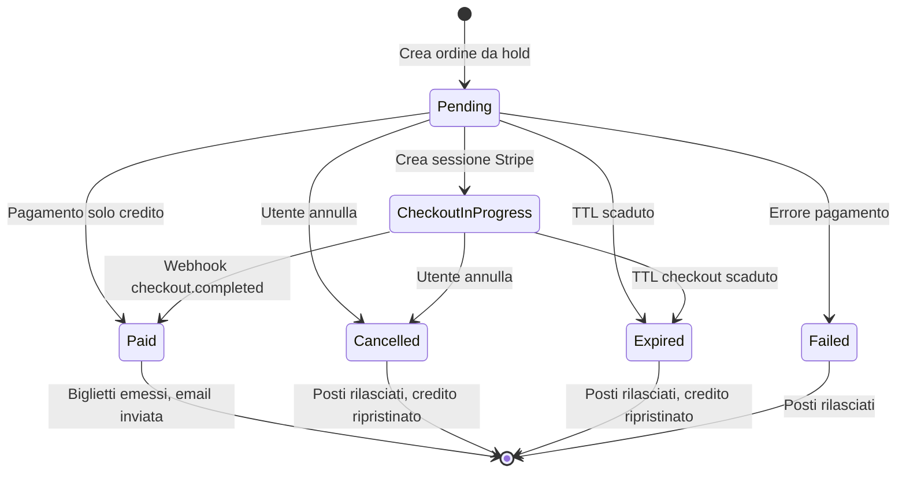
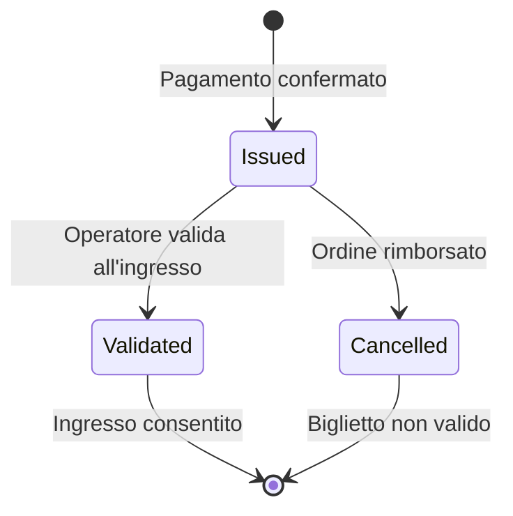

# Modello Dati

## Panoramica

Il database si basa su Entity Framework Core con MySQL. Il modello dati è suddiviso in tre domini principali e comprende **37 entità**, **6 enumerazioni** e **9 vincoli di unicità**.

---

## Tabella Riepilogativa Entità

| Dominio | Entità | Descrizione | Relazioni Chiave |
|---------|--------|-------------|-------------------|
| **Cinema Multisala** | `Film` | Film cinematografico | 1 regista, N proiezioni, N show, N categorie |
| | `Regista` | Regista film | N film |
| | `Categoria` | Categoria film | N film (many-to-many) |
| | `Cinema` | Sede cinematografica | N sale, N proiezioni, N show |
| | `Sala` | Sala all'interno del cinema | N posti, N show |
| | `SalaPosto` | Posto singolo con coordinate | 1 sala |
| | `Show` | Spettacolo programmato | 1 film, 1 cinema, 1 sala |
| | `Proiezione` | Entità legacy (da migrare) | Bridge verso Show |
| **Ticketing** | `ShowPostoStato` | Stato posto per show | Hold/Sold per utente |
| | `Ordine` | Ordine di acquisto | N biglietti, 1 user, 1 show |
| | `Biglietto` | Biglietto digitale emesso | 1 ordine, 1 posto |
| | `Prenotazione` | Entità legacy pre-ticketing | Mantenuta per compatibilità |
| **Utenti & Pagamenti** | `User` | Utente della piattaforma | N ordini, N biglietti, N refresh token |
| | `MovimentoCredito` | Transazione credito | 1 utente, opzionale 1 ordine |
| | `RefreshToken` | JWT refresh token | 1 utente, device-aware |
| | `UserExternalLogin` | Social login link | 1 utente, 1 provider |

---

## Diagrammi Entità-Relazioni per Dominio

### Dominio Cinema Multisala (Film, Regista, Categorie, Cinema, Sale, Posti, Show)



### Dominio Ticketing (Ordini, Biglietti, ShowPostoStato)



### Dominio Utenti e Pagamenti (User, Credito, Auth)



---

## Enumerazioni

| Enum | Valori | Valore Int | Descrizione |
|------|--------|-----------|-------------|
| `TipoSala` | DueD, TreD, ISENSE, XL | 0-3 | Tipologia sala cinematografica |
| `OrdineState` | Pending, Paid, Failed, Cancelled, Expired, CheckoutInProgress | 0-5 | Ciclo di vita dell'ordine |
| `ShowPostoState` | Hold, Sold | 0-1 | Stato posto per uno show |
| `BigliettoState` | Issued, Validated, Cancelled | 0-2 | Ciclo di vita del biglietto |
| `MovimentoCreditoTipo` | TopUp, DebitOrder, Refund, Adjustment | 0-3 | Tipo transazione credito |
| `UserRole` | User, PowerUser, Admin | 0-2 | Ruoli utente (RBAC) |

---

## Ciclo di Vita dell'Ordine



### Tabella Transizioni di Stato

| Stato Iniziale | Evento | Stato Finale | Azioni |
|----------------|--------|-------------|--------|
| (nessuno) | Utente seleziona posti + click continua | Pending | Hold token consumato, ordine creato |
| Pending | Pagamento con credito riuscito | Paid | Credito addebitato, biglietti emessi |
| Pending | Stripe Checkout avviato | CheckoutInProgress | Sessione Stripe creata, credito riservato |
| Pending | Utente clicca annulla | Cancelled | Posti rilasciati, hold rimosso |
| Pending | TTL hold superato | Expired | Cleanup automatico, posti liberati |
| CheckoutInProgress | Webhook checkout.completed | Paid | Credito riservato addebitato, biglietti emessi |
| CheckoutInProgress | Webhook checkout.expired | Expired | Rilascio posti, credito ripristinato |
| CheckoutInProgress | Utente annulla | Cancelled | Rilascio posti, credito ripristinato |

---

## Ciclo di Vita del Biglietto



---

## Indici Unici

| Tabella | Colonne | Descrizione |
|---------|---------|-------------|
| `Sala` | `(CinemaId, NumeroProgressivo)` | Unicità numero sala per cinema |
| `SalaPosto` | `(SalaId, Settore, Fila, Numero)` | Unicità posto nella sala |
| `Show` | `(CinemaId, SalaId, StartAtUtc)` | Due show non possono iniziare nello stesso momento nella stessa sala |
| `ShowPostoStato` | `(ShowId, SalaPostoId)` | Un solo stato per posto per show |
| `Ordine` | `CodiceOrdine` | Codice ordine univoco |
| `Ordine` | `IdempotencyKey` | Evita duplicati in caso di rete |

---

## Migration EF Core

| Migration | Data | Modifiche |
|-----------|------|-----------|
| InitialCreate | Iterazione 2 | Schema base: Film, Regista, Cinema, Proiezione, Prenotazione |
| AddRefreshTokenDeviceId | 2026-04-13 | Colonna DeviceId su RefreshToken per auth device-aware |
| AddMultisalaTicketing | 2026-04-16 | 7 nuove tabelle (Sala, SalaPosto, Show, ShowPostoStato, Ordine, Biglietto, MovimentoCredito) + data migration legacy |
| AddStripeCheckoutFieldsToOrdine | 2026-04-19 | Campi Stripe Checkout su Ordine (SessionId, CheckoutExpiresAt, CreditoRiservato) |

### Comandi

```bash
# Creare una migration
dotnet ef migrations add NomeMigration --project backend/FilmAPI

# Applicare al database
dotnet ef database update --project backend/FilmAPI
```

---

## Blocchi di Codice Commentati

### Modello Film (entità principale)

```csharp
// backend/FilmAPI/Model/Film.cs
// Ogni entità EF Core ha: [Key] per la chiave primaria,
// [Required] per campi obbligatori, [MaxLength] per stringhe,
// [ForeignKey] per relazioni, [Column(TypeName)] per tipi decimali

public class Film
{
    [Key]
    public int Id { get; set; }                    // Chiave primaria auto-increment

    [Required]
    [MaxLength(200)]
    public string Titolo { get; set; } = string.Empty;  // Titolo obbligatorio, max 200 char

    [Required]
    public int RegistaId { get; set; }              // FK verso Regista

    [ForeignKey(nameof(RegistaId))]
    public Regista? Regista { get; set; }           // Navigation property (nullable per lazy load)

    [Required]
    public int Durata { get; set; }                 // Durata in minuti

    [MaxLength(2000)]
    public string? DescrizioneLunga { get; set; }   // Trama del film (opzionale)

    // Campi TMDB per dati reali dal seeder
    public int? TmdbId { get; set; }                // ID su TMDB
    public double? VoteAverage { get; set; }        // Voto medio TMDB

    // Collection navigation properties (relazioni 1:N e N:M)
    public ICollection<Show> Shows { get; set; } = new List<Show>();
    public ICollection<FilmCategoria> FilmCategorie { get; set; } = new List<FilmCategoria>();
}
```

### DbContext con configurazione relazioni e indici

```csharp
// backend/FilmAPI/Data/FilmDbContext.cs
// Il DbContext è il ponte tra il codice C# e MySQL.
// Ogni DbSet corrisponde a una tabella del database.

public class FilmDbContext : DbContext
{
    // Ogni DbSet è una tabella nel DB
    public DbSet<Film> Films => Set<Film>();
    public DbSet<Cinema> Cinemas => Set<Cinema>();
    public DbSet<Sala> Sale => Set<Sala>();
    public DbSet<SalaPosto> SalaPosti => Set<SalaPosto>();
    public DbSet<Show> Shows => Set<Show>();
    public DbSet<ShowPostoStato> ShowPostiStato => Set<ShowPostoStato>();
    public DbSet<Ordine> Ordini => Set<Ordine>();
    public DbSet<Biglietto> Biglietti => Set<Biglietto>();
    public DbSet<MovimentoCredito> MovimentiCredito => Set<MovimentoCredito>();
    public DbSet<User> Users => Set<User>();
    public DbSet<RefreshToken> RefreshTokens => Set<RefreshToken>();

    protected override void OnModelCreating(ModelBuilder modelBuilder)
    {
        // Esempio di indice unico composto:
        // Impedisce due show nella stessa sala allo stesso orario
        modelBuilder.Entity<Show>()
            .HasIndex(s => new { s.CinemaId, s.SalaId, s.StartAtUtc })
            .IsUnique();

        // Esempio di delete behavior:
        // Se elimino un Cinema, elimino anche le Sale collegate
        modelBuilder.Entity<Sala>()
            .HasOne(s => s.Cinema)
            .WithMany(c => c.Sale)
            .OnDelete(DeleteBehavior.Cascade);
    }
}
```

### Transazione atomica per hold posti (pattern importante)

```csharp
// backend/FilmAPI/Services/SeatHoldService.cs
// Pattern: transazione atomica per operazioni multi-tabella

public async Task<SeatHoldResponseDTO> CreateHoldAsync(int userId, SeatHoldRequestDTO request)
{
    // 1. Pulizia hold scaduti per questo show
    await CleanupExpiredHoldsForShowAsync(request.ShowId);

    // 2. Verifica conflitti: posti già tenuti da altri
    var conflitti = await _db.ShowPostiStato
        .Where(sps => sps.ShowId == request.ShowId
            && request.SalaPostoIds.Contains(sps.SalaPostoId)
            && sps.Stato != ShowPostoState.Sold)  // Sold escluso, Hold è conflitto
        .ToListAsync();

    if (conflitti.Any())
        return new SeatHoldResponseDTO { Conflitti = conflitti };

    // 3. Transazione atomica: tutto o niente
    using var tx = await _db.Database.BeginTransactionAsync();
    try
    {
        foreach (var postoId in request.SalaPostoIds)
        {
            _db.ShowPostiStato.Add(new ShowPostoStato
            {
                ShowId = request.ShowId,
                SalaPostoId = postoId,
                UserId = userId,
                Stato = ShowPostoState.Hold,
                HoldToken = holdToken,
                ScadeAtUtc = DateTime.UtcNow.AddMinutes(_holdTtlMinutes),
                UpdatedAtUtc = DateTime.UtcNow
            });
        }
        await _db.SaveChangesAsync();
        await tx.CommitAsync();  // Se arriva qui, TUTTO è salvato
    }
    catch
    {
        await tx.RollbackAsync();  // Se errore, NIENTE viene salvato
        throw;
    }
}
```
