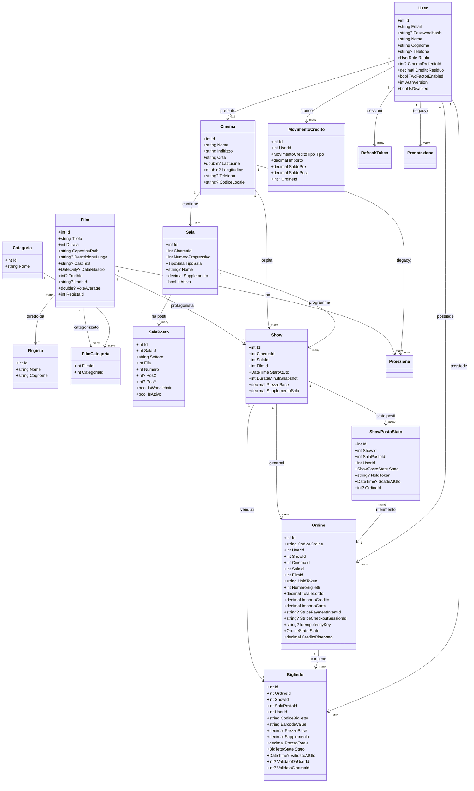
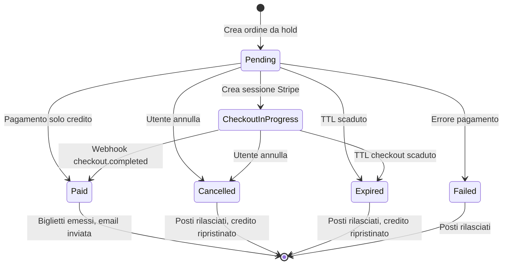

# Modello Dati

## Panoramica Entità

Il database si basa su Entity Framework Core con MySQL. Il modello dati è suddiviso in tre domini principali:
1. **Dominio Cinema Multisala** — Sale, Posti, Show
2. **Dominio Ticketing** — Ordini, Biglietti, Hold Posti
3. **Dominio Utente & Pagamenti** — Utenti, Credito, Movimenti, Auth

---

## Diagramma Entità-Relazioni



---

## Enumerazioni

### TipoSala
```csharp
public enum TipoSala {
    DueD = 0,    // Sala 2D standard
    TreD = 1,    // Sala 3D
    ISENSE = 2,  // Sala premium ISENSE
    XL = 3       // Sala grande formato
}
```

### OrdineState (macchina a stati principale)
```csharp
public enum OrdineState {
    Pending = 0,            // Ordine creato, in attesa pagamento
    Paid = 1,               // Pagato con successo
    Failed = 2,             // Pagamento fallito
    Cancelled = 3,          // Annullato dall'utente
    Expired = 4,            // Scaduto (TTL hold superato)
    CheckoutInProgress = 5  // Checkout Stripe hosted in corso
}
```

### ShowPostoState
```csharp
public enum ShowPostoState {
    Hold = 0,  // Posto tenuto temporaneamente
    Sold = 1   // Posto venduto (biglietto emesso)
}
```

### BigliettoState
```csharp
public enum BigliettoState {
    Issued = 0,     // Emesso
    Validated = 1,  // Validato all'ingresso
    Cancelled = 2   // Annullato
}
```

### MovimentoCreditoTipo
```csharp
public enum MovimentoCreditoTipo {
    TopUp = 0,       // Ricarica credito
    DebitOrder = 1,  // Addebito per ordine
    Refund = 2,      // Rimborso
    Adjustment = 3   // Rettifica manuale (admin)
}
```

### UserRole (RBAC)
```csharp
public enum UserRole {
    User = 0,       // Utente base: acquista biglietti
    PowerUser = 1,  // Operatore: gestisce film, sale, show
    Admin = 2       // Amministratore: full access inclusi utenti e credito
}
```

---

## Ciclo di Vita dell'Ordine



---

## Indici Unici Configurati

| Tabella | Colonna/e | Descrizione |
|---------|-----------|-------------|
| `Sala` | `(CinemaId, NumeroProgressivo)` | Unicità numero sala per cinema |
| `SalaPosto` | `(SalaId, Settore, Fila, Numero)` | Unicità posto nella sala |
| `Show` | `(CinemaId, SalaId, StartAtUtc)` | Unicità spettacolo per sala/orario |
| `ShowPostoStato` | `(ShowId, SalaPostoId)` | Un posto, uno stato per show |
| `ShowPostoStato` | `HoldToken` | Unicità token di hold |
| `Ordine` | `CodiceOrdine` | Unicità codice ordine |
| `Ordine` | `IdempotencyKey` | Idempotenza (client-generated) |
| `Biglietto` | `(ShowId, SalaPostoId)` | Un biglietto per posto per show |
| `Biglietto` | `CodiceBiglietto` | Unicità codice biglietto |

---

## Migration EF Core

La migration principale è `AddMultisalaTicketing` che ha:
1. Creato lo schema completo multisala/ticketing (7 nuove tabelle)
2. Eseguito la data migration legacy:
   - Inizializzato `CreditoResiduo = 0` per utenti esistenti
   - Creata `Sala 1` di default per cinema senza sale
   - Migrato `Proiezione -> Show` con composizione `StartAtUtc` da `Data + Ora`
   - Gestito conflitti temporali con sale auto-migrate

Altre migrations:
- `AddRefreshTokenDeviceId`: Aggiunto `DeviceId` ai refresh token
- `AddStripeCheckoutFieldsToOrdine`: Aggiunti campi per Stripe Checkout hosted

```bash
# Comandi EF Core usati
dotnet ef migrations add NomeMigration --project backend/FilmAPI
dotnet ef database update --project backend/FilmAPI
```
