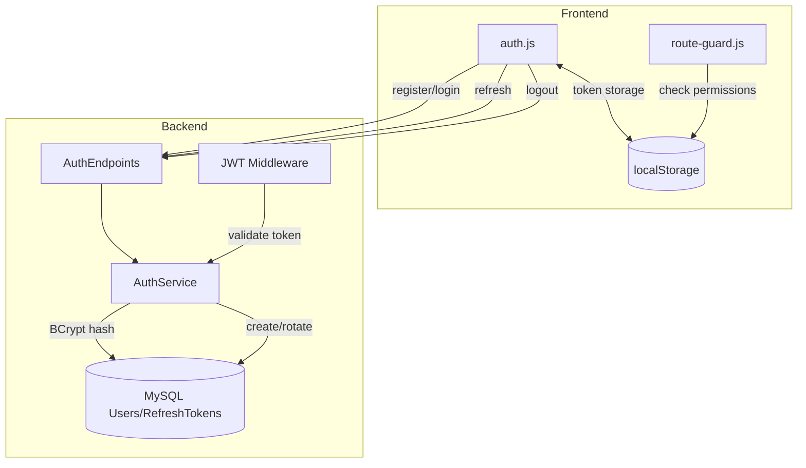
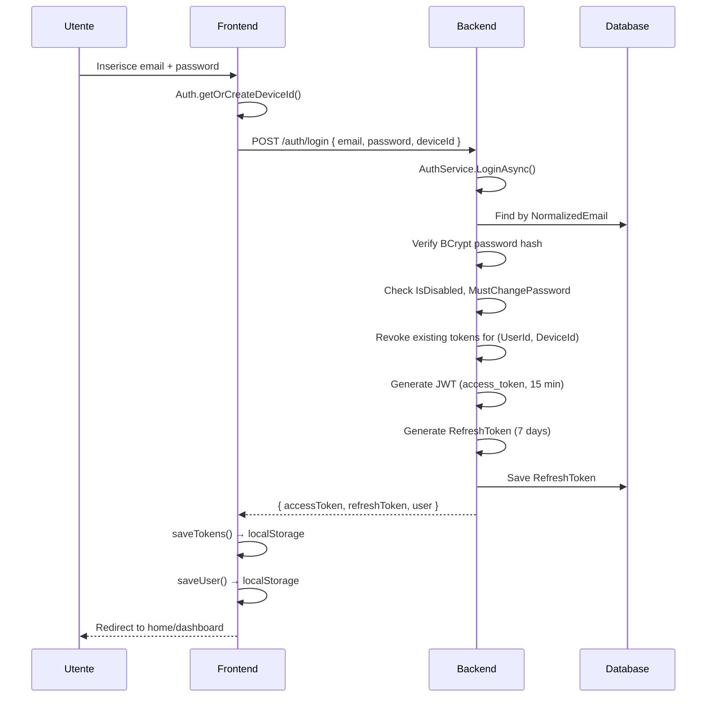
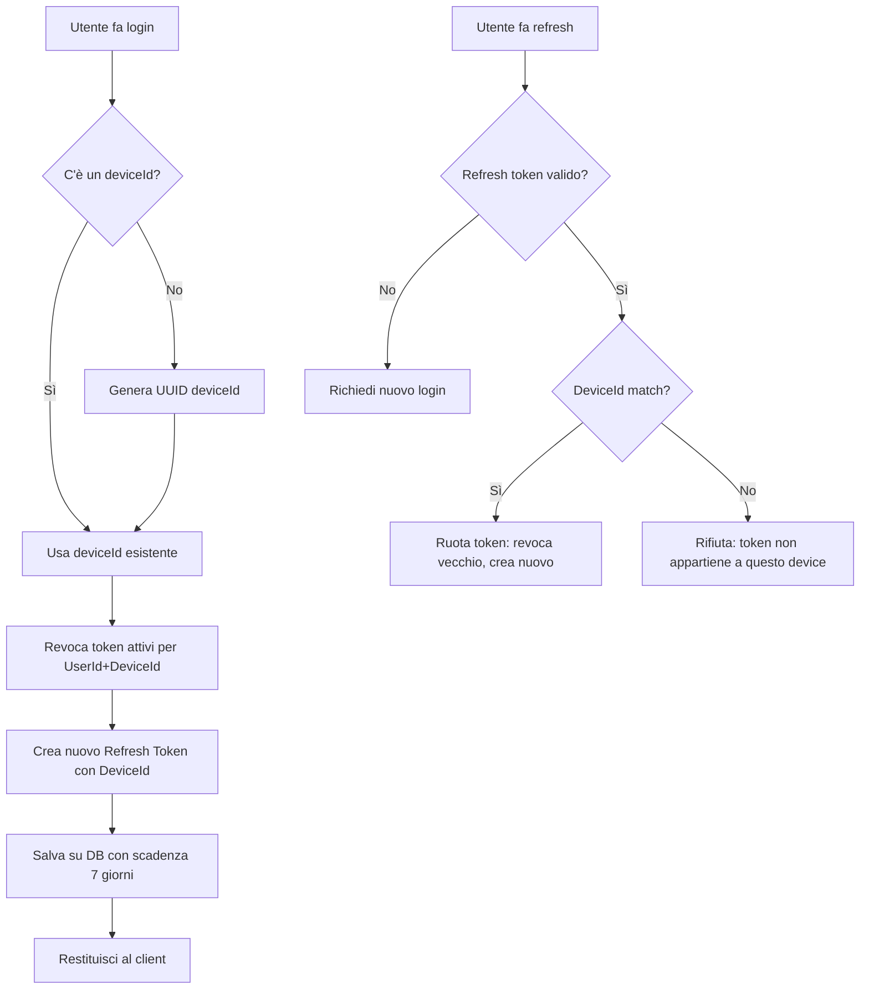
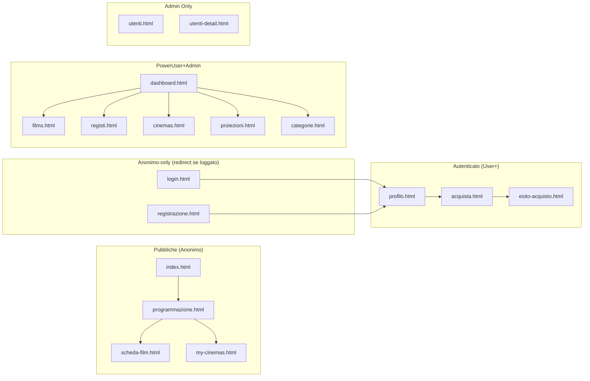

# Sistema di Autenticazione

## Panoramica

CineBase implementa un sistema di autenticazione completo e sicuro basato su **JWT (JSON Web Token)** con **refresh token rotanti** e **device identity**. Supporta autenticazione locale (email/password) e social login (Google, Microsoft, Facebook).

---

## Architettura Auth



---

## Flusso di Login



---

## JWT Claims

Il token JWT contiene i seguenti claim:

| Claim | Descrizione |
|-------|-------------|
| `sub` | User ID |
| `email` | Email utente |
| `name` | Nome completo |
| `role` | Ruolo (User/PowerUser/Admin) |
| `auth_version` | Versione sicurezza (invalida token dopo cambio password) |
| `iat` | Issued at |
| `exp` | Expiration (15 minuti) |

## Refresh Token Device-Aware



---

## RBAC — Matrice dei Permessi

### Livelli di Ruolo

| Ruolo | Valore | Permessi |
|-------|--------|----------|
| `User` | 0 | Acquisto biglietti, profilo personale |
| `PowerUser` | 1 | CRUD film, registi, categorie, sale, show |
| `Admin` | 2 | Tutto + gestione utenti, ricariche credito, diagnostica |

### Mappa Pagine Frontend



### Endpoint API per Ruolo

| Auth | Endpoint |
|------|----------|
| `AllowAnonymous` | `GET /films`, `GET /cinemas`, `GET /programmazione/*`, `GET /shows`, `GET /sale`, `POST /auth/login`, `POST /auth/register`, `POST /auth/refresh`, `GET /config/frontend` |
| `Authenticated` | `GET/PUT /profilo`, `GET /checkout/*`, `POST /checkout/*`, `POST /auth/logout`, `GET /credito/me`, `GET /biglietti` |
| `PowerUserOrAdmin` | `POST/PUT/DELETE /films`, `POST/PUT/DELETE /shows`, `POST/PUT/DELETE /sale`, `POST/PUT/DELETE /registi`, `POST/PUT/DELETE /categorie` |
| `AdminOnly` | `GET/POST /admin/utenti`, `GET/POST /admin/credito`, `DELETE /cinemas` |

---

## Route Guard Frontend

Il `route-guard.js` è un **IIFE (Immediately Invoked Function Expression)** eseguito nell'`<head>` di ogni pagina HTML prima che qualsiasi contenuto venga renderizzato.

```javascript
// Logica principale (semplificata)
var RouteGuard = (function () {
  var PAGE_PERMISSIONS = {
    '/dashboard.html': { roles: ['poweruser', 'admin'], authRequired: true },
    '/acquista.html':  { roles: ['user', 'poweruser', 'admin'], authRequired: true },
    '/utenti.html':    { roles: ['admin'], authRequired: true },
    '/login.html':     { roles: ['anonimo'], anonymousOnly: true },
    // ... per ogni pagina
  };

  function check() {
    var path = window.location.pathname;
    var perm = PAGE_PERMISSIONS[path];
    if (!perm) return;  // pagina non protetta

    var token = localStorage.getItem('cb_access_token');
    var role = normalizeRole(parseJwt(token)?.role);

    if (perm.anonymousOnly && role !== 'anonimo') {
      window.location.replace('/index.html');  // replace, non href
      return;
    }

    if (perm.authRequired && role === 'anonimo') {
      window.location.replace('/login.html?redirect=' + encodeURIComponent(path));
      return;
    }

    if (!perm.roles.includes(role)) {
      window.location.replace('/index.html?forbidden=true');
      return;
    }
  }

  check();  // Esecuzione immediata
})();
```

### Caratteristiche chiave:
- **Esecuzione sincrona** prima del rendering DOM — nessun flash di pagina non autorizzata
- **`window.location.replace()`** invece di `href` — non lascia pagine bloccate nella history
- **Self-contained**: legge e parsifica JWT direttamente da localStorage senza dipendere da `auth.js`
- **Refresh proattivo**: se l'access token è scaduto, tenta refresh prima del redirect a login

---

## Social Login

Supporto per login tramite provider esterni:
- **Google** / **Microsoft** / **Facebook**

Flusso:
1. Utente clicca "Accedi con Google" → redirect a `GET /auth/external/login?provider=Google`
2. Backend genera `ExternalAuthState` con PKCE e redirect
3. Provider esterno autentica utente e redirect a callback
4. Backend scambia codice per token, crea/collega utente
5. Redirect frontend a `social-login-complete.html` con JWT

---

## 2FA (Two-Factor Authentication)

- Basato su **TOTP** (Time-based One-Time Password)
- Generazione secret → scansiona QR code con Google Authenticator
- Verifica codice OTP a 6 cifre
- Attivabile/disattivabile dalla pagina profilo

## Security Features

| Feature | Implementazione |
|---------|----------------|
| Password hashing | BCrypt |
| JWT signing | HMAC-SHA256 con chiave segreta |
| Auth version | Claim `auth_version` invalida token dopo cambio password |
| Device-aware refresh | Refresh token legato a `UserId + DeviceId` |
| Token cleanup | `RefreshTokenCleanupService` (hosted service, ogni 30 min) |
| Rate limiting | Middleware ASP.NET Core |
| Input validation | Data Annotations + FluentValidation sui DTO |
| CORS | Configurato per frontend su porta 5001 |
| Password reset | Token temporaneo via email + AccountActionToken |
| Account disable | Admin può disabilitare utenti (blocca login) |
| Must change password | Forza cambio password al prossimo login |
