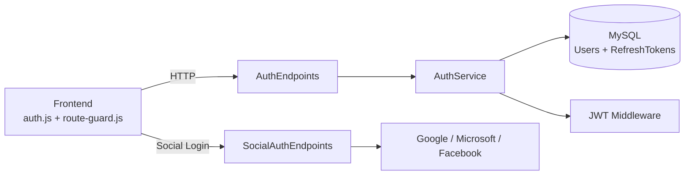
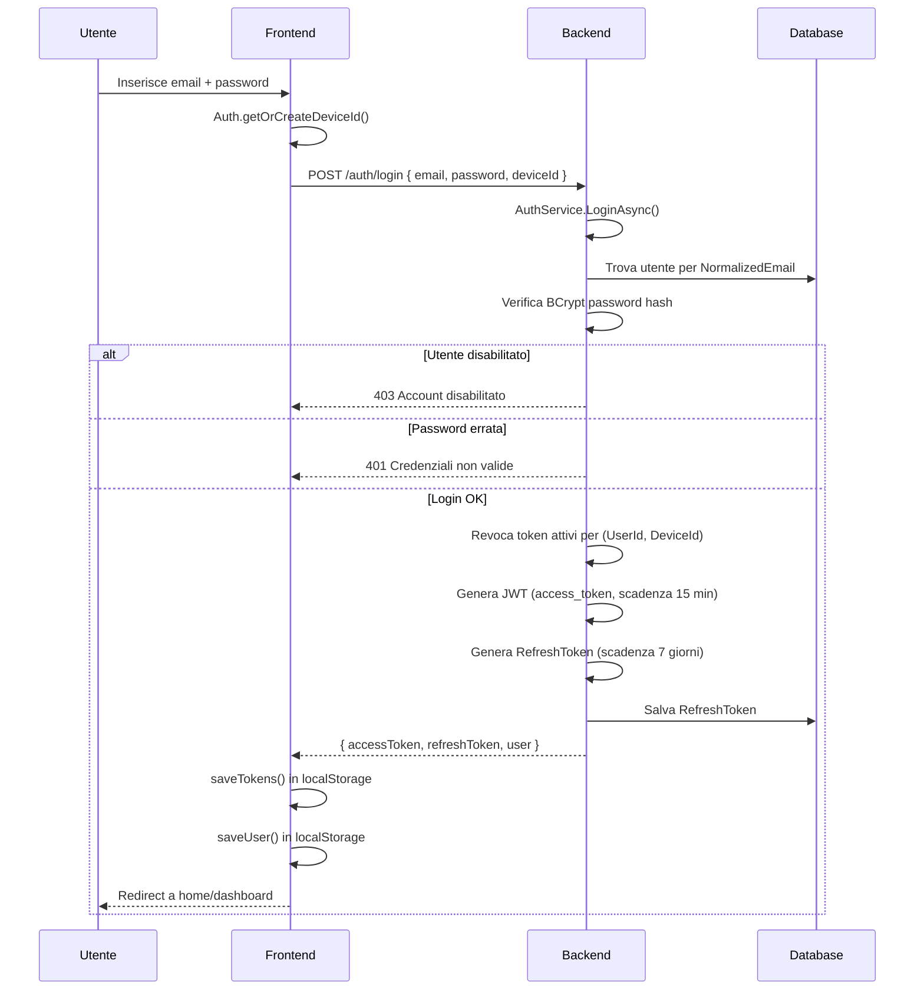
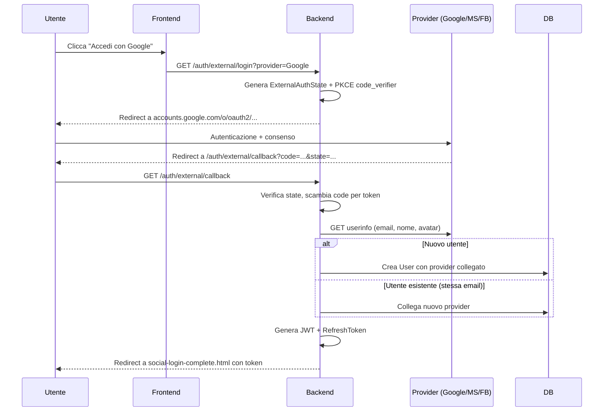

# Sistema di Autenticazione

## Panoramica

CineBase implementa un sistema di autenticazione completo basato su JWT con refresh token rotanti e device identity. Supporta login locale (email/password con BCrypt) e social login tramite Google, Microsoft e Facebook.

| Funzionalità | Implementazione | Stato |
|-------------|----------------|-------|
| Login/Register locale | JWT + BCrypt + DeviceId | Attivo |
| Social login (Google/Microsoft/Facebook) | OAuth2 + PKCE + ExternalAuthState | Attivo |
| Refresh token rotanti | Revoca su ogni refresh | Attivo |
| Device-aware auth | Refresh token legato a UserId+DeviceId | Attivo |
| 2FA (TOTP) | Google Authenticator, secret+verifica | Attivo |
| Route guard frontend | IIFE self-contained nel head | Attivo |
| RBAC (3 ruoli) | User, PowerUser, Admin | Attivo |
| AuthVersion | Invalida token dopo cambio password | Attivo |
| RefreshTokenCleanupService | Hosted service ogni 30 min | Attivo |

---

## Architettura del Sistema Auth


    AS -->|BCrypt verify| DB
    AS -->|create/validate JWT| JWT
    AS -->|rotate tokens| RT
    SES -->|OAuth2 flow| GOOG
    SES -->|OAuth2 flow| MSFT
    SES -->|OAuth2 flow| FB
```

---

## Flusso di Login Locale



---

## Struttura del JWT

| Claim | Tipo | Descrizione |
|-------|------|-------------|
| `sub` | string | User ID (int) |
| `email` | string | Email utente |
| `name` | string | Nome e cognome |
| `role` | string | Ruolo (User/PowerUser/Admin) |
| `auth_version` | int | Versione sicurezza (cambio password = incremento) |
| `iat` | int | Issued at (Unix timestamp) |
| `exp` | int | Expiration (Unix timestamp, 15 min) |

---

## Matrice di Controllo Accessi (RBAC)

### Pagine Frontend

| Pagina | Anonimo | User | PowerUser | Admin |
|--------|---------|------|-----------|-------|
| `index.html` | ✅ | ✅ | ✅ | ✅ |
| `programmazione.html` | ✅ | ✅ | ✅ | ✅ |
| `scheda-film.html` | ✅ | ✅ | ✅ | ✅ |
| `my-cinemas.html` | ✅ | ✅ | ✅ | ✅ |
| `login.html` | ✅ (solo anonimo) | ❌ | ❌ | ❌ |
| `registrazione.html` | ✅ (solo anonimo) | ❌ | ❌ | ❌ |
| `acquista.html` | ❌ | ✅ | ✅ | ✅ |
| `pagamento.html` | ❌ | ✅ | ✅ | ✅ |
| `esito-acquisto.html` | ❌ | ✅ | ✅ | ✅ |
| `profilo.html` | ❌ | ✅ | ✅ | ✅ |
| `dashboard.html` | ❌ | ❌ | ✅ | ✅ |
| `films.html` | ❌ | ❌ | ✅ | ✅ |
| `registi.html` | ❌ | ❌ | ✅ | ✅ |
| `cinemas.html` | ❌ | ❌ | ✅ | ✅ |
| `proiezioni.html` | ❌ | ❌ | ✅ | ✅ |
| `categorie.html` | ❌ | ❌ | ✅ | ✅ |
| `utenti.html` | ❌ | ❌ | ❌ | ✅ |
| `validazione.html` | ❌ | ❌ | ✅ | ✅ |

### Endpoint API

| Auth Richiesto | Metodi | Esempi |
|----------------|--------|--------|
| `AllowAnonymous` | GET pubblici | `/films`, `/cinemas`, `/programmazione/*`, `/auth/login` |
| `Authenticated` | Profilo e acquisti | `/profilo/*`, `/checkout/*`, `/credito/me` |
| `PowerUserOrAdmin` | CRUD gestione | `POST/PUT/DELETE /films`, `/shows`, `/sale` |
| `AdminOnly` | Utenti e diagnostica | `/admin/utenti/*`, `/admin/credito/*` |

---

## Route Guard Frontend

Il `route-guard.js` è un IIFE eseguito nell'head della pagina prima del rendering del body, garantendo zero flash di pagine non autorizzate.

```javascript
var RouteGuard = (function () {
  var PAGE_PERMISSIONS = { /* mappa percorsi -> ruoli */ };

  function check() {
    var path = window.location.pathname;
    var perm = PAGE_PERMISSIONS[path];
    if (!perm) return;

    var token = localStorage.getItem('cb_access_token');
    var role = normalizeRole(parseJwt(token)?.role);

    // Anonimo su pagina solo-autenticati → redirect a login
    if (perm.authRequired && role === 'anonimo') {
      window.location.replace('/login.html?redirect=' + encodeURIComponent(path));
      return;
    }

    // Autenticato su pagina solo-anonimo → redirect a home
    if (perm.anonymousOnly && role !== 'anonimo') {
      window.location.replace('/index.html');
      return;
    }

    // Ruolo non permesso → redirect con forbidden
    if (!perm.roles.includes(role)) {
      window.location.replace('/index.html?forbidden=true');
      return;
    }
  }
  check(); // Esecuzione immediata
})();
```

### Caratteristiche

| Caratteristica | Dettaglio |
|---------------|-----------|
| Esecuzione | IIFE sincrono nel `<head>`, prima del `DOMContentLoaded` |
| Redirect | `window.location.replace()` per non lasciare pagine bloccate nella history |
| Dipendenza | Zero dipendenze da auth.js (legge JWT direttamente da localStorage) |
| Refresh proattivo | Se token scaduto, tenta refresh prima del redirect |
| Parsing JWT | Decodifica base64 inline, nessuna libreria esterna |

---

## Refresh Token Device-Aware

| Passo | Descrizione |
|-------|-------------|
| 1 | Al login, `auth.js` genera un UUID `deviceId` (o riusa `web-default` per legacy) |
| 2 | Il deviceId viene inviato a `/auth/login` e salvato sul RefreshToken |
| 3 | Al refresh, il backend verifica che il token appartenga allo stesso device |
| 4 | I token precedenti per lo stesso `(UserId, DeviceId)` vengono revocati |
| 5 | Il `RefreshTokenCleanupService` rimuove periodicamente token scaduti/revocati |

---

## Social Login Flow



---

## 2FA (Two-Factor Authentication)

| Passo | Descrizione |
|-------|-------------|
| 1 | Utente abilita 2FA da profilo |
| 2 | Backend genera secret TOTP (base32) |
| 3 | Frontend mostra QR code (scansionabile con Google Authenticator) |
| 4 | Utente inserisce codice a 6 cifre per verifica |
| 5 | 2FA attivato, login successivi richiedono codice TOTP |

---

## Security Features

| Feature | Implementazione |
|---------|----------------|
| Password hashing | BCrypt con salt automatico |
| JWT signing | HMAC-SHA256 con chiave segreta in .env |
| Auth version | Claim `auth_version` invalida tutti i token dopo cambio password |
| Device-aware refresh | Refresh token legato a UserId + DeviceId |
| Token cleanup | Hosted service ogni 30 minuti |
| Account disable | Admin può disabilitare, blocca ogni login |
| Must change password | Flag forza cambio password al prossimo login |
| Rate limiting | Middleware ASP.NET Core |
| Input validation | Data Annotations + validazione DTO |
| CORS | Configurato per frontend su porta 5001 |
| Password reset | Token temporaneo via email con scadenza |
| 2FA reset/disabilita | Verifica identità prima della disattivazione |
