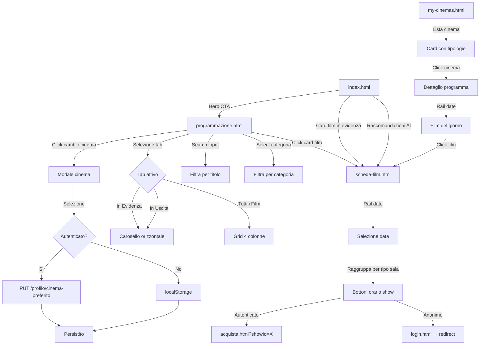
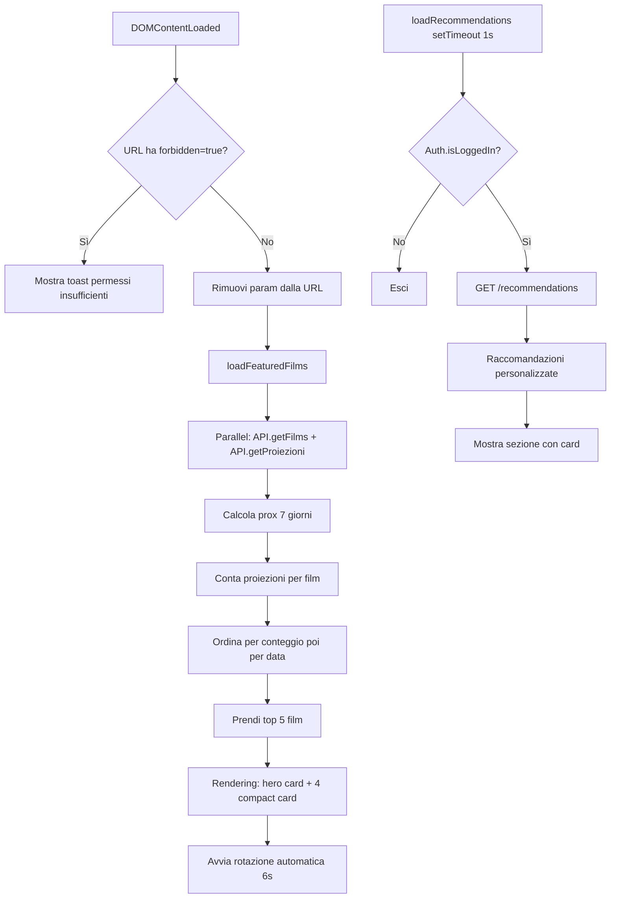
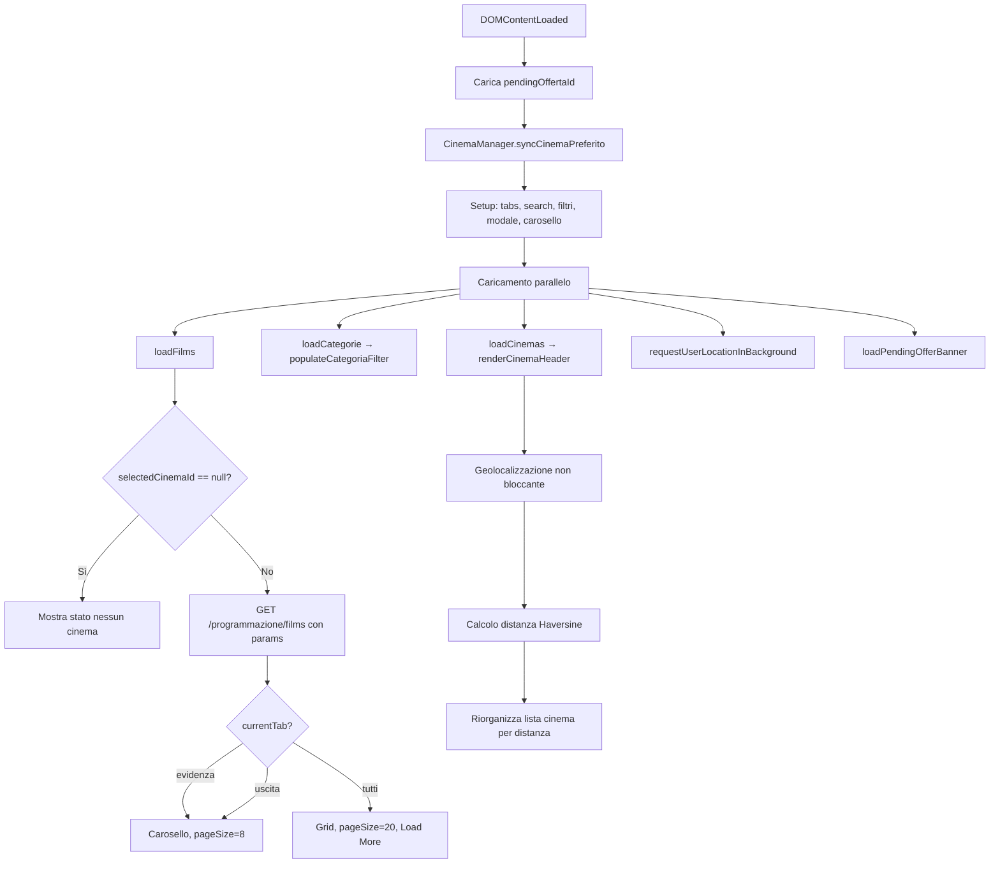

# Programmazione Pubblica e Catalogo Film

## Panoramica

La sezione pubblica permette agli utenti di esplorare la programmazione cinematografica con ricerca avanzata, filtri per categoria, geolocalizzazione dei cinema e selezione persistente del cinema preferito.

---

## Tabella delle Pagine

| Pagina | URL | File JS | Accesso | API Chiamate |
|--------|-----|---------|---------|--------------|
| Home | `index.html` | `home.js` | Pubblico | `getFilms`, `getProiezioni`, `/recommendations` |
| Programmazione | `programmazione.html` | `programmazione.js` | Pubblico | `getProgrammazioneFilms`, `getProgrammazioneCinemas`, `getCinemaPreferito` |
| Scheda Film | `scheda-film.html` | `scheda-film.js` | Pubblico | `getFilmScheda` |
| My Cinemas | `my-cinemas.html` | `my-cinemas.js` | Pubblico | `getMyCinemas`, `getCinemaSchedule` |

---

## Flusso di Navigazione Completo



---

## Home Page (index.html)

### Logica di `home.js`



### API Chiamate

| Chiamata | Endpoint | Parametri |
|----------|----------|-----------|
| `API.getFilms()` | `GET /films` | `page=1, pageSize=100` |
| `API.getProiezioni()` | `GET /proiezioni` | nessuno |
| Raccomandazioni | `GET /recommendations` | Bearer token (auth) |

---

## Programmazione (programmazione.html)

### Logica di `programmazione.js`

Il cuore della pagina è il `CinemaManager`, un modulo che gestisce la persistenza del cinema selezionato con sincronizzazione bidirezionale tra localStorage e backend.



### Tabella dei Tab

| Tab | Descrizione | Layout | Page Size | Comportamento |
|-----|-------------|--------|-----------|---------------|
| In Evidenza | Film con proiezioni nei prossimi 7 giorni | Carosello orizzontale | 8 | Scroll infinito, caricamento automatico |
| In Uscita | Film senza proiezioni ma con data rilascio futura | Carosello orizzontale | 8 | Scroll infinito, caricamento automatico |
| Tutti i Film | Tutti i film presenti nel catalogo | Grid 4 colonne responsive | 20 | Pulsante "Carica altri" |

### CinemaManager: Persistenza Bidirezionale

```javascript
const CinemaManager = {
  STORAGE_KEY: 'cb_selected_cinema',

  syncCinemaPreferito() {
    if (!auth?.isLoggedIn()) return this.getLocalCinemaId();

    const backendId = await API.getCinemaPreferito();
    const localId = this.getLocalCinemaId();

    if (backendId != null) {
      this.setLocalCinemaId(backendId);   // backend → localStorage
      return backendId;
    }
    if (localId != null) {
      await API.setCinemaPreferito(localId); // localStorage → backend
      return localId;
    }
    return null;
  }
};
```

---

## Scheda Film (scheda-film.html)

| Elemento | Descrizione |
|----------|-------------|
| Hero | Copertina full-width, titolo, durata, anno, categorie badge |
| Metadati | Regista, cast, descrizione lunga, voto TMDB |
| Rail Date | Componente `date-rail.js` con 7 giorni scorrevoli |
| Show | Raggruppati per TipoSala (2D, 3D, ISENSE, XL) |
| Bottoni | Auth-aware: autenticato → acquista, anonimo → login con redirect |

### API

| Chiamata | Endpoint |
|----------|----------|
| `API.getFilmScheda(id, cinemaId)` | `GET /films/{id}/scheda?cinemaId=` |

---

## My Cinemas (my-cinemas.html)

| Vista | Contenuto |
|-------|-----------|
| Lista cinema | Card con nome, città, indirizzo, tipologie sala, distanza km |
| Dettaglio cinema (`?IdCinema=X`) | Header cinema, rail date, film del giorno con orari show |

### API

| Chiamata | Endpoint |
|----------|----------|
| `API.getMyCinemas()` | `GET /my-cinemas` |
| `API.getCinemaSchedule(cinemaId, date)` | `GET /my-cinemas/{cinemaId}/schedule?date=` |

---

## Endpoint Backend Programmazione

| Metodo | Endpoint | Auth | Descrizione |
|--------|----------|------|-------------|
| GET | `/programmazione/films` | AllowAnonymous | Listing paginato con tab, search, categoria, cinemaId |
| GET | `/programmazione/cinemas` | AllowAnonymous | Elenco cinema con ordinamento per distanza |
| GET | `/films/{id}/scheda` | AllowAnonymous | Scheda film con calendario show |
| GET | `/my-cinemas` | AllowAnonymous | Elenco cinema per vista cinema-centric |
| GET | `/my-cinemas/{cinemaId}/schedule` | AllowAnonymous | Programmazione giornaliera di un cinema |
| GET | `/profilo/cinema-preferito` | Authenticated | Legge cinema preferito utente |
| PUT | `/profilo/cinema-preferito/{cinemaId}` | Authenticated | Imposta cinema preferito |

---

## Calcolo Distanza Haversine

Il backend calcola la distanza tra utente e cinema usando la formula di Haversine:

```csharp
double Distance(double lat1, double lon1, double lat2, double lon2) {
    const double R = 6371; // Raggio terrestre in km
    double dLat = ToRad(lat2 - lat1);
    double dLon = ToRad(lon2 - lon1);
    double a = Math.Sin(dLat/2) * Math.Sin(dLat/2) +
               Math.Cos(ToRad(lat1)) * Math.Cos(ToRad(lat2)) *
               Math.Sin(dLon/2) * Math.Sin(dLon/2);
    double c = 2 * Math.Atan2(Math.Sqrt(a), Math.Sqrt(1-a));
    return R * c;
}
```
