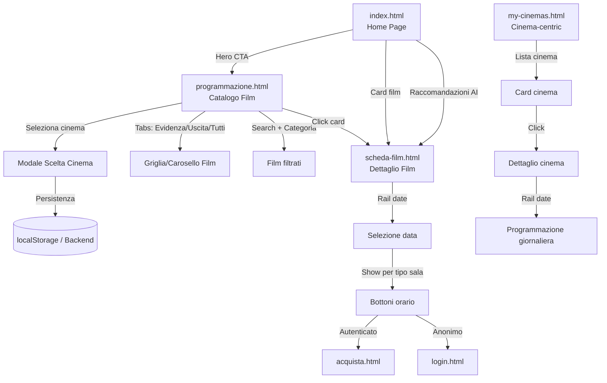
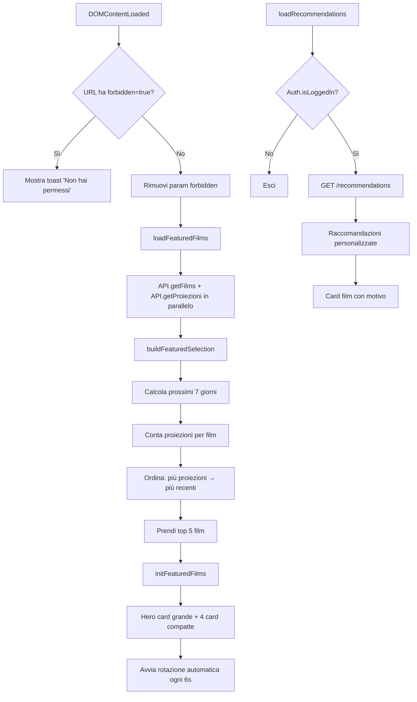
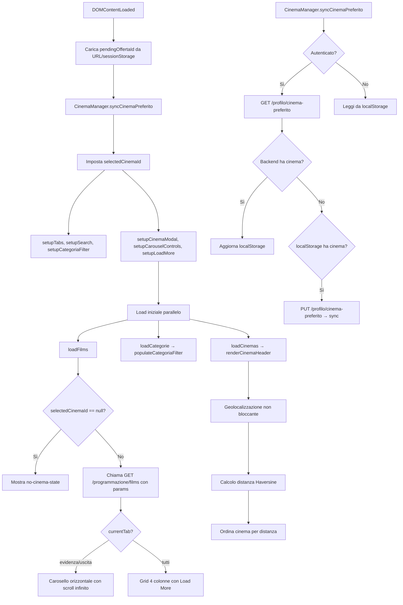

# Programmazione Pubblica e Catalogo Film

## Panoramica

La sezione pubblica di CineBase permette agli utenti di esplorare la programmazione cinematografica in modo moderno, con ricerca, filtri, geolocalizzazione e selezione del cinema preferito.

---

## Pagine Coinvolte

| Pagina | File HTML | File JS | Descrizione |
|--------|-----------|---------|-------------|
| Home | `index.html` | `home.js` | Hero cinematico + film in evidenza + raccomandazioni AI |
| Programmazione | `programmazione.html` | `programmazione.js` | Catalogo film-centric con tabs, ricerca, filtri |
| Scheda Film | `scheda-film.html` | `scheda-film.js` | Dettaglio film con rail date e orari show |
| My Cinemas | `my-cinemas.html` | `my-cinemas.js` | Vista cinema-centric con programmazione giornaliera |

---

## Flusso di Navigazione Pubblica



---

## Home Page (`index.html`)

### Logica (`home.js`)



### API Chiamate
- `API.getFilms({ page: 1, pageSize: 100 })` — tutti i film
- `API.getProiezioni()` — proiezioni per calcolo "In Evidenza"
- `GET /recommendations` — raccomandazioni AI (solo autenticato)

---

## Programmazione (`programmazione.html`)

### Logica (`programmazione.js`)



### CinemaManager

Il `CinemaManager` gestisce la persistenza del cinema selezionato:

```javascript
const CinemaManager = {
  STORAGE_KEY: 'cb_selected_cinema',

  // Anonimo: localStorage
  getLocalCinemaId() { ... },
  setLocalCinemaId(cinemaId) { ... },

  // Autenticato: backend come source of truth
  async syncCinemaPreferito() {
    const auth = getAuthSafe();
    if (!auth || !auth.isLoggedIn()) return this.getLocalCinemaId();

    const backendId = await API.getCinemaPreferito();
    const localId = this.getLocalCinemaId();

    // Sincronizzazione bidirezionale
    if (backendId != null) {
      this.setLocalCinemaId(backendId);
      return backendId;
    }
    if (localId != null) {
      await API.setCinemaPreferito(localId);
      return localId;
    }
    return null;
  },

  async setCinema(cinemaId) {
    this.setLocalCinemaId(cinemaId);
    if (auth?.isLoggedIn()) await API.setCinemaPreferito(cinemaId);
    window.dispatchEvent(new CustomEvent('cinema:changed', { ... }));
  }
};
```

### Tabs e Caroselli

| Tab | Comportamento | Page Size |
|-----|---------------|-----------|
| **In Evidenza** | Film con show nei prossimi 7 giorni. Carosello orizzontale con scroll infinito | 8 film per page |
| **In Uscita** | Film senza show attivi ma con data rilascio futura. Carosello orizzontale | 8 film per page |
| **Tutti i Film** | Grid 4 colonne responsive con paginazione server-side "Carica altri" | 20 film per page |

### API Chiamate
- `API.getProgrammazioneFilms(params)` — `GET /programmazione/films?tab=&search=&categoriaId=&cinemaId=&page=&pageSize=`
- `API.getProgrammazioneCinemas(params)` — `GET /programmazione/cinemas?lat=&lng=`
- `API.getCinemaPreferito()` — `GET /profilo/cinema-preferito`
- `API.setCinemaPreferito(id)` — `PUT /profilo/cinema-preferito/{id}`

---

## Scheda Film (`scheda-film.html`)

### Logica (`scheda-film.js`)

1. Legge `id` e `cinema` dalla query string
2. Carica scheda da `GET /films/{id}/scheda?cinemaId=`
3. Renderizza:
   - **Hero**: copertina, titolo, metadati, descrizione, cast, regista
   - **Rail date orizzontale**: component `date-rail.js` con giorni dinamici
   - **Show raggruppati per TipoSala**: 2D, 3D, ISENSE, XL
   - **Bottoni orario** auth-aware: autenticato → acquista, anonimo → login con redirect
   - **Modale cambio cinema** con sync cinema preferito

```mermaid
flowchart TD
    A[Carica scheda film] --> B[GET /films/{id}/scheda?cinemaId=]
    B --> C{Risposta OK?}
    C -->|No| D[Mostra errore]
    C -->|Sì| E[Render hero: copertina, titolo, cast]
    E --> F[Init date-rail: oggi + 7 giorni]
    F --> G[Seleziona data corrente]
    G --> H[Render show raggruppati per tipo sala]
    H --> I{Utente autenticato?}
    I -->|Sì| J[Bottone → /acquista.html?showId=X]
    I -->|No| K[Bottone → /login.html?redirect=/acquista.html]
```

### API Chiamate
- `API.getFilmScheda(id, cinemaId)` — `GET /films/{id}/scheda?cinemaId=`

---

## My Cinemas (`my-cinemas.html`)

### Logica (`my-cinemas.js`)

Due viste:
1. **Lista cinema**: card con nome, città, indirizzo, tipologie sala, distanza
2. **Dettaglio cinema** (`?IdCinema=X`): header info cinema, rail date, film del giorno con show

### API Chiamate
- `API.getMyCinemas()` — `GET /my-cinemas`
- `API.getCinemaSchedule(cinemaId, date)` — `GET /my-cinemas/{cinemaId}/schedule?date=`

---

## Endpoint Backend Programmazione

| Metodo | Endpoint | Auth | Descrizione |
|--------|----------|------|-------------|
| `GET` | `/programmazione/films` | AllowAnonymous | Listing film con tab, search, categoria, cinemaId, paginato |
| `GET` | `/programmazione/cinemas` | AllowAnonymous | Elenco cinema con ordinamento per distanza (Haversine) |
| `GET` | `/films/{id}/scheda` | AllowAnonymous | Scheda film completa con calendario show |
| `GET` | `/my-cinemas` | AllowAnonymous | Elenco cinema per vista cinema-centric |
| `GET` | `/my-cinemas/{cinemaId}/schedule` | AllowAnonymous | Programmazione giornaliera di un cinema |
| `GET` | `/profilo/cinema-preferito` | Authenticated | Legge cinema preferito |
| `PUT` | `/profilo/cinema-preferito/{cinemaId}` | Authenticated | Imposta cinema preferito |
| `PUT` | `/profilo/cinema-preferito` | Authenticated | Cancella cinema preferito |

### Servizi Backend

| Servizio | Metodi Principali |
|----------|-------------------|
| `IProgrammazioneService` | `GetFilmsAsync`, `GetCinemasAsync`, `GetFilmSchedaAsync`, `GetMyCinemasAsync`, `GetCinemaScheduleAsync` |
| `IProfiloService` | `GetCinemaPreferitoAsync`, `SetCinemaPreferitoAsync` |
| `IFilmService` | CRUD completo film |
| `ICinemaService` | CRUD completo cinema |

### Calcolo Distanza (Haversine)

Il backend calcola la distanza tra l'utente e i cinema usando la formula di Haversine:

```csharp
// Semplificato
double Distance(double lat1, double lon1, double lat2, double lon2) {
    const double R = 6371; // Raggio Terra in km
    double dLat = ToRad(lat2 - lat1);
    double dLon = ToRad(lon2 - lon1);
    double a = Math.Sin(dLat/2) * Math.Sin(dLat/2) +
               Math.Cos(ToRad(lat1)) * Math.Cos(ToRad(lat2)) *
               Math.Sin(dLon/2) * Math.Sin(dLon/2);
    double c = 2 * Math.Atan2(Math.Sqrt(a), Math.Sqrt(1-a));
    return R * c;
}
```
