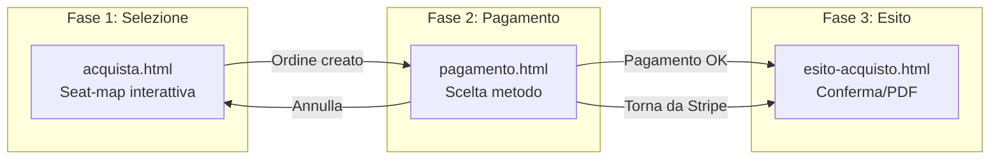
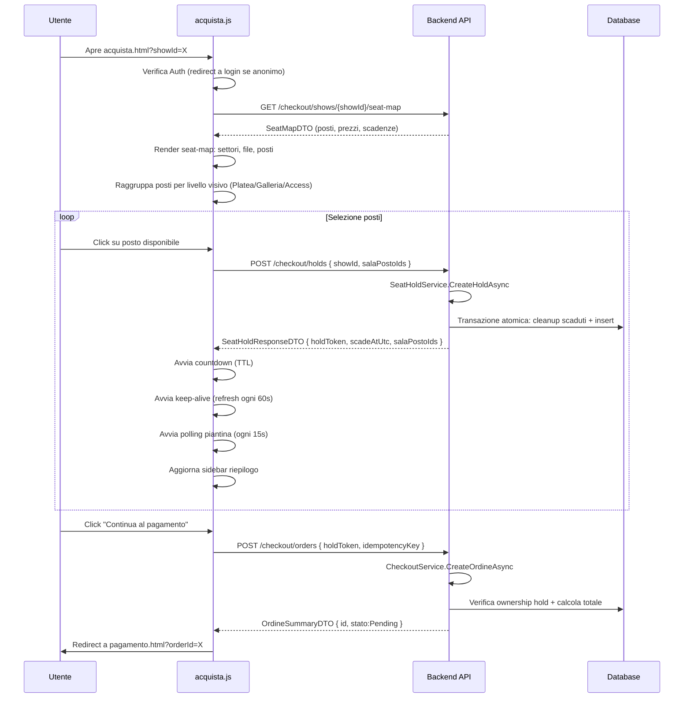
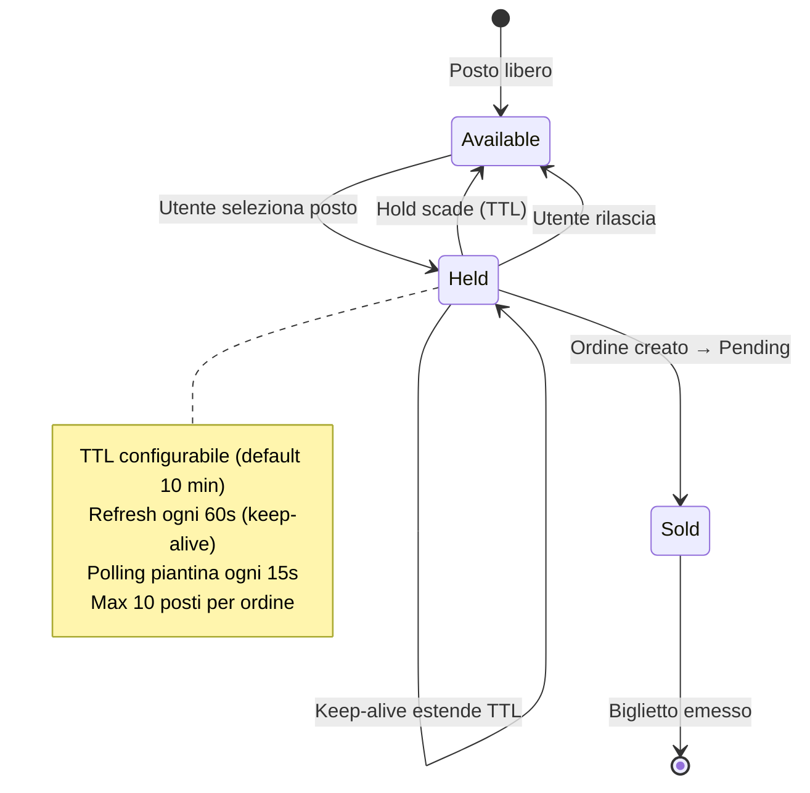

# Flusso di Acquisto Biglietti

## Panoramica

Il flusso di acquisto è composto da 3 pagine principali che guidano l'utente dalla selezione dei posti alla conferma finale.

---

## Architettura del Flusso



---

## Flusso Completo Acquisto



---

## Pagina Acquisto (`acquista.html`) — `acquista.js`

### Mappa Posti Interattiva (Seat-map)

```mermaid
flowchart TD
    A[loadSeatMap] --> B[GET /checkout/shows/{showId}/seat-map]
    B --> C[renderShowInfo: film, cinema, sala, data, prezzo]
    C --> D[renderSeatMap]

    D --> E[buildSectorGroups: raggruppa posti per settore→fila]
    E --> F[buildVisualLevels: Platea, Galleria, Accessibilità, Altri]
    F --> G[Render HTML con griglie per ogni settore]

    G --> H[applySeatMapZoom: scala trasformazione]
    H --> I[setupZoomControls]

    I --> J{Utente clicca posto}
    J -->|Disponibile| K[selectedSeatIds.add(seatId)]
    K --> L[API.createHold: hold posti selezionati]
    L --> M{Aggiorna holdToken, scadeAtUtc}
    M --> N[renderSeatMap: aggiorna colori posti]
    N --> O[updateSummary: riepilogo sidebar]

    J -->|Già selezionato| P[selectedSeatIds.delete(seatId)]
    P --> Q{selectedSeatIds.size === 0?}
    Q -->|Sì| R[releaseHold]
    Q -->|No| S[refreshHoldSeats]
```

### Stati dei Posti (SeatStatus)

```csharp
public enum SeatStatus {
    Available = 0,     // Verde: posto libero
    HeldByOther = 1,   // Grigio: tenuto da altro utente
    HeldByMe = 2,      // Arancione: tenuto da me (stessa sessione)
    Sold = 3           // Rosso: già venduto
}
```

### Zoom Avanzato

| Funzione | Descrizione |
|----------|-------------|
| **Zoom +/-** | 9 livelli: da 0.6x a 1.5x |
| **Reset** | Torna a zoom 1x |
| **Ctrl + rotellina** | Mouse wheel con Ctrl (desktop) |
| **Pinch-trackpad** | Pin to zoom su trackpad |

```javascript
const ZOOM_LEVELS = [0.6, 0.75, 0.85, 0.95, 1, 1.1, 1.2, 1.35, 1.5];
const DEFAULT_ZOOM_INDEX = 4; // 1x

function applySeatMapZoom() {
    const zoom = ZOOM_LEVELS[zoomIndex];
    layout.style.transform = `scale(${zoom})`;
}
```

### Visual Layout dei Settori

I posti vengono raggruppati in livelli visivi ordinati:

```javascript
function buildVisualLevels(grouped) {
    const access = settori che iniziano con "ACCESS"
    const galleria = settori che iniziano con "GALLERIA"
    const platea = settori che iniziano con "PLATEA"
    const vip = settori rimanenti

    // Ordine di rendering:
    // 1. Accessibilità (compatta)
    // 2. Galleria (SX - CENTRO - DX)
    // 3. Platea (SX - CENTRO - DX)
    // 4. Altri settori (VIP, etc.)
}
```

### Hold Posti (Temporary Lock)



### Parametri Configurabili

| Parametro | .env | Default | Descrizione |
|-----------|------|---------|-------------|
| `HOLD_TTL_MINUTES` | `HOLD_TTL_MINUTES` | 10 | Durata hold posti in minuti |
| `MAX_SEATS_PER_ORDER` | `MAX_SEATS_PER_ORDER` | 10 | Massimo posti per ordine |
| `DEFAULT_TICKET_PRICE` | `DEFAULT_TICKET_PRICE` | 8.50 | Prezzo base biglietto |

### Countdown e Keep-Alive

```javascript
const KEEP_ALIVE_INTERVAL = 60000;  // Refresh hold ogni 60s
const SEAT_POLL_INTERVAL = 15000;   // Polling piantina ogni 15s

function startCountdown() {
    countdownInterval = setInterval(() => {
        updateCountdownDisplay(); // MM:SS
        if (diff <= 0) {
            // Rilascia posti, mostra toast "Tempo scaduto"
        }
    }, 1000);
}

function startKeepAlive() {
    keepAliveInterval = setInterval(async () => {
        const result = await API.refreshHold(holdToken);
        holdExpiresAt = new Date(result.scadeAtUtc);
    }, KEEP_ALIVE_INTERVAL);
}
```

### Pulizia Hold Scaduti

Il `ExpiredHoldCleanupService` è un **hosted service** backend che:

```csharp
public class ExpiredHoldCleanupService : BackgroundService {
    protected override async Task ExecuteAsync(CancellationToken ct) {
        while (!ct.IsCancellationRequested) {
            await CleanupExpiredHoldsAsync();
            await Task.Delay(CleanupInterval, ct); // default 5 min
        }
    }

    // Rimuove record ShowPostoStato con Stato=Hold e ScadeAtUtc scaduto
    // Rilascia ordini CheckoutInProgress scaduti + credito riservato
}
```

---

## Endpoint Backend Checkout

| Metodo | Endpoint | Auth | Descrizione |
|--------|----------|------|-------------|
| `GET` | `/checkout/shows/{showId}/seat-map` | Authenticated | Piantina posti con stati aggiornati |
| `POST` | `/checkout/holds` | Authenticated | Crea hold posti (409 se conflitto) |
| `POST` | `/checkout/holds/{holdToken}/refresh` | Authenticated | Estendi TTL hold |
| `DELETE` | `/checkout/holds/{holdToken}` | Authenticated | Rilascia hold |
| `POST` | `/checkout/orders` | Authenticated | Crea ordine Pending da hold |
| `GET` | `/checkout/orders` | Authenticated | Lista ordini utente |
| `GET` | `/checkout/orders/{orderId}` | Authenticated | Dettaglio ordine |
| `POST` | `/checkout/orders/{orderId}/cancel` | Authenticated | Annulla ordine Pending |

### Servizi Backend

| Servizio | Metodi Principali |
|----------|-------------------|
| `ISeatHoldService` | `GetSeatMapAsync`, `CreateHoldAsync`, `RefreshHoldAsync`, `ReleaseHoldAsync`, `CleanupExpiredHoldsAsync` |
| `ICheckoutService` | `CreateOrdineAsync`, `GetOrdiniByUserAsync`, `GetOrdineByIdAsync` |
| `ExpiredHoldCleanupService` | Hosted service per cleanup periodico |

### Validazione Anti-Overlap (Backend)

Il `CreateHoldAsync` esegue in una **transazione atomica**:

1. Cleanup hold scaduti per lo show
2. Verifica che tutti i posti appartengano alla sala dello show
3. Controlla conflitti: posti già venduti (Sold) o holdati da altri utenti
4. Genera `HoldToken` univoco: `{userId}_{showId}_{guid}`
5. Imposta TTL configurabile
6. Se conflitto → restituisce 409 Conflict con dettagli
7. Limite massimo 10 posti per ordine

```csharp
public async Task<SeatHoldResponseDTO> CreateHoldAsync(int userId, SeatHoldRequestDTO request) {
    // 1. Cleanup scaduti
    await CleanupExpiredHoldsForShowAsync(request.ShowId);

    // 2. Validazione posti appartengono alla sala
    var posti = await ...;
    if (posti.Count != request.SalaPostoIds.Count)
        throw new BadRequestException("Posti non validi");

    // 3. Controllo conflitti
    var conflitti = await ...;
    if (conflitti.Any())
        return new SeatHoldResponseDTO { Conflitti = conflitti };

    // 4. Limite 10 posti
    if (request.SalaPostoIds.Count > MAX_SEATS)
        throw new BadRequestException($"Max {MAX_SEATS} posti");

    // 5. Crea hold in transazione
    using var tx = await _db.Database.BeginTransactionAsync();
    // ... insert su ShowPostoStato ...
    await tx.CommitAsync();

    return new SeatHoldResponseDTO { HoldToken = token, ScadeAtUtc = expiresAt };
}
```
