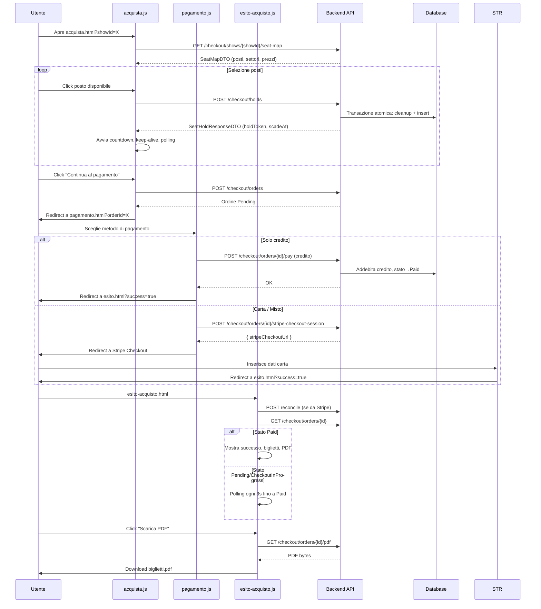
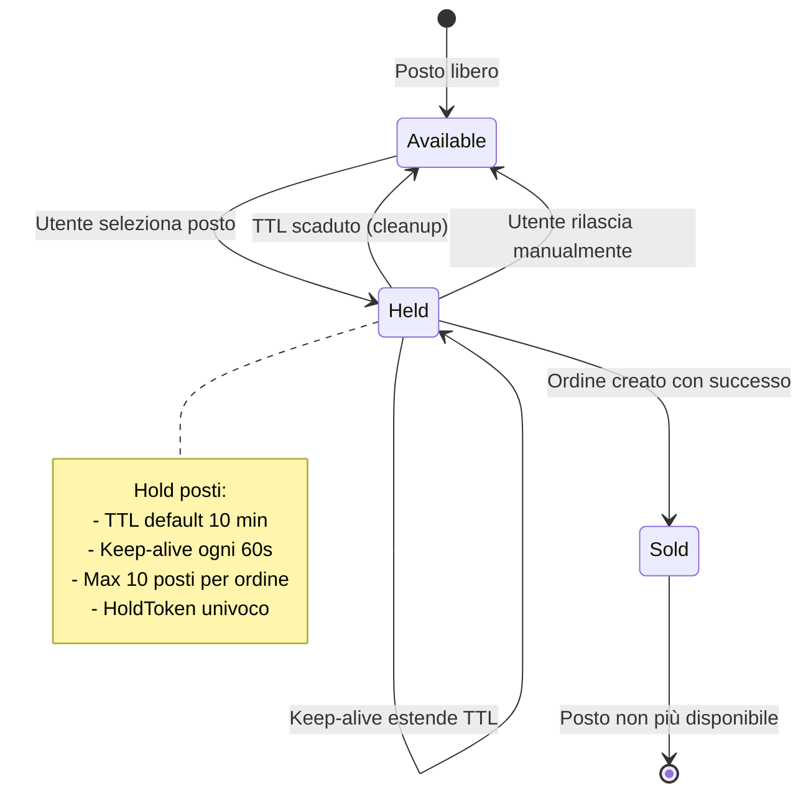

# Flusso di Acquisto Biglietti

## Panoramica

Il flusso di acquisto si compone di tre pagine consecutive che guidano l'utente dalla selezione dei posti fino alla conferma finale dell'ordine.

---

## Tabella delle Pagine

| Pagina | URL | File JS | Scopo | API Chiamate |
|--------|-----|---------|-------|--------------|
| Acquisto | `acquista.html` | `acquista.js` | Seat-map interattiva, selezione posti, hold | `getSeatMap`, `createHold`, `refreshHold`, `releaseHold`, `createOrdine` |
| Pagamento | `pagamento.html` | `pagamento.js` | Scelta metodo, Stripe Checkout, credito | `getOrdine`, `getCreditoMe`, `payOrdine`, `createStripeCheckoutSession`, `cancelOrdine` |
| Esito | `esito-acquisto.html` | `esito-acquisto.js` | Conferma, download PDF, polling | `getOrdine`, `reconcileCheckoutSession`, `getOrdinePdf` |

---

## Flusso di Acquisto Completo



---

## Seat-Map Interattiva

### Stati dei Posti

| Stato | Valore | Colore | Descrizione |
|-------|--------|--------|-------------|
| Available | 0 | Verde scuro | Posto libero e selezionabile |
| HeldByOther | 1 | Grigio | Posto tenuto da un altro utente |
| HeldByMe | 2 | Arancione | Posto tenuto dall'utente corrente |
| Sold | 3 | Rosso scuro | Posto già venduto |

### Zoom Control

| Funzione | Comportamento |
|----------|---------------|
| Pulsante + | Ingrandisce (zoom index +1) |
| Pulsante - | Riduce (zoom index -1) |
| Pulsante Reset | Torna a zoom 1x (index 4) |
| Ctrl + rotellina | Zoom con mouse wheel su desktop |
| Pinch trackpad | Zoom su trackpad |

```javascript
const ZOOM_LEVELS = [0.6, 0.75, 0.85, 0.95, 1, 1.1, 1.2, 1.35, 1.5];
const DEFAULT_ZOOM_INDEX = 4; // 1x
```

### Organizzazione Visiva dei Settori

| Livello | Settori | Render |
|---------|---------|--------|
| 1. Accessibilità | Settori che iniziano con "ACCESS" | Compatto, in cima |
| 2. Galleria | Settori che iniziano con "GALLERIA" | Ordine: SX, CENTRO, DX |
| 3. Platea | Settori che iniziano con "PLATEA" | Ordine: SX, CENTRO, DX |
| 4. Altri | Settori rimanenti (VIP, etc.) | In fondo |

---

## Hold Posti: Ciclo di Vita



### Parametri Configurabili

| Variabile .env | Default | Descrizione |
|----------------|---------|-------------|
| `HOLD_TTL_MINUTES` | 10 | Minuti di validità dell'hold |
| `HOLD_CLEANUP_INTERVAL_MINUTES` | 5 | Intervallo cleanup automatico |
| `MAX_SEATS_PER_ORDER` | 10 | Massimo posti acquistabili per ordine |
| `DEFAULT_TICKET_PRICE` | 8.50 | Prezzo base biglietto |

### Validazione Backend (CreateHoldAsync)

1. Cleanup hold scaduti per lo show
2. Verifica appartenenza posti alla sala dello show
3. Controllo conflitti con altri utenti
4. Generazione HoldToken univoco
5. Impostazione TTL configurabile
6. Verifica limite massimo 10 posti
7. Transazione atomica su database

---

## Endpoint Backend Checkout

| Metodo | Endpoint | Auth | Descrizione |
|--------|----------|------|-------------|
| GET | `/checkout/shows/{showId}/seat-map` | Authenticated | Piantina posti con stati aggiornati |
| POST | `/checkout/holds` | Authenticated | Crea hold posti (409 se conflitto) |
| POST | `/checkout/holds/{holdToken}/refresh` | Authenticated | Estendi TTL hold |
| DELETE | `/checkout/holds/{holdToken}` | Authenticated | Rilascia hold |
| POST | `/checkout/orders` | Authenticated | Crea ordine Pending da hold |
| GET | `/checkout/orders` | Authenticated | Lista ordini utente |
| GET | `/checkout/orders/{orderId}` | Authenticated | Dettaglio ordine |
| POST | `/checkout/orders/{orderId}/cancel` | Authenticated | Annulla ordine Pending |

---

## Servizi Backend

| Servizio | Metodi Principali |
|----------|-------------------|
| `ISeatHoldService` | `GetSeatMapAsync`, `CreateHoldAsync`, `RefreshHoldAsync`, `ReleaseHoldAsync`, `CleanupExpiredHoldsAsync` |
| `ICheckoutService` | `CreateOrdineAsync`, `GetOrdiniByUserAsync`, `GetOrdineByIdAsync` |
| `ExpiredHoldCleanupService` | Hosted service per cleanup periodico hold scaduti |
