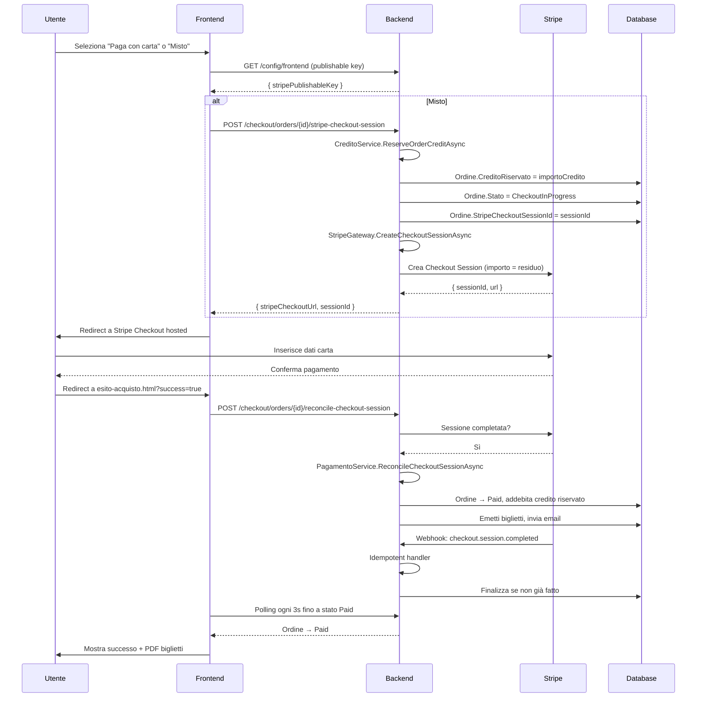
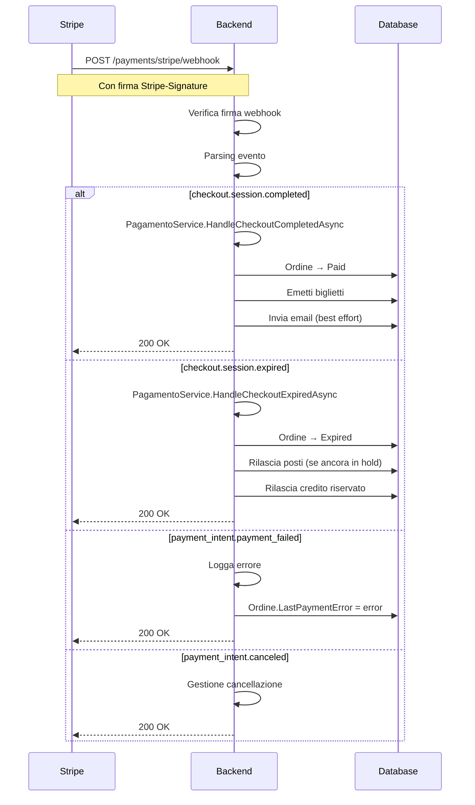

# Pagamenti

## Panoramica

CineBase supporta tre modalità di pagamento:
1. **Solo credito** — pagamento interno alla piattaforma (nessun addebito esterno)
2. **Solo carta** — Stripe Checkout Session hosted
3. **Misto (credito + carta)** — quota credito + residuo su Stripe

L'architettura è evoluta da Stripe Elements (embedded) a **Stripe Checkout hosted** per maggiore sicurezza e minore complessità PCI.

---

## Metodi di Pagamento

```mermaid
flowchart TD
    PAG[pagamento.html] --> M{Metodo scelto}
    
    M -->|Solo Credito| CRED[Paga con credito]
    CRED --> POST[POST /checkout/orders/{id}/pay]
    POST --> VER{Saldo sufficiente?}
    VER -->|Sì| OK[Ordine → Paid]
    VER -->|No| ERR[Mostra errore]
    OK --> ESITO[esito-acquisto.html]

    M -->|Solo Carta| CARTA[POST /checkout/orders/{id}/stripe-checkout-session]
    CARTA --> STS[Crea sessione Stripe Checkout]
    STS --> RED[Redirect a checkout.stripe.com]
    RED --> WEB{Webhook completed?}
    WEB -->|Sì| FIN[Finalizza ordine]
    WEB -->|No| POLL[Polling riconciliazione]
    FIN --> ESITO2[esito-acquisto.html]

    M -->|Misto| MISTO[Riserva credito + crea sessione Stripe]
    MISTO --> RES[CreditoRiservato = importo]
    RES --> STS2[Crea sessione Stripe per residuo]
    STS2 --> RED2[Redirect a Stripe]
    RED2 --> WEB2{Webhook completed?}
    WEB2 -->|Sì| FIN2[Addebita credito riservato + finalizza]
    WEB2 -->|No| POLL2[Polling + rilascio credito se scade]
```

---

## Flusso Stripe Checkout Hosted



---

## Pagina Pagamento (`pagamento.html`) — `pagamento.js`

### Logica

```mermaid
flowchart TD
    A[DOMContentLoaded] --> B{Autenticato?}
    B -->|No| C[Redirect login]
    B -->|Sì| D[Carica ordine, credito, config in parallelo]

    D --> E{Stato ordine?}
    E -->|CheckoutInProgress| F[Tenta reconcile]
    F --> G{Ancora CheckoutInProgress?}
    G -->|Sì| H[Cancella ordine + redirect esito]
    G -->|No| I[Riprova]

    E -->|Pending| J[renderOrderSummary]
    J --> K[setupPaymentOptions]
    K --> L[Credito sufficiente? → abilita option-credito]
    K --> M[Saldo > 0? → abilita option-misto]

    L --> N[Attendi click Paga]
    M --> N

    N --> O{Metodo?}
    O -->|Credito| P[POST /checkout/orders/{id}/pay]
    O -->|Carta| Q[POST /checkout/orders/{id}/stripe-checkout-session]
    O -->|Misto| R[POST con importoCreditoRichiesto]
    Q --> S[Redirect a Stripe]
    R --> S
```

### Scelta Metodo

L'interfaccia mostra tre opzioni radio:

```html
<input type="radio" name="payment-method" value="carta">   <!-- Sempre attivo -->
<input type="radio" name="payment-method" value="credito"> <!-- Solo se saldo >= totale -->
<input type="radio" name="payment-method" value="misto">   <!-- Solo se saldo > 0 -->
```

Per il metodo **misto**, uno slider permette di scegliere quanto credito usare:

```javascript
const slider = document.getElementById('credit-slider');
slider.max = Math.min(saldo, Math.max(0, totale - 0.01)); // Almeno 0.01 su carta
slider.value = Math.min(saldo, Math.max(0, totale - 0.01)); // Default: massimo credito
```

### Gestione Back Button da Stripe

```javascript
window.addEventListener('pageshow', async (e) => {
    if (e.persisted) {
        // Utente tornato da Stripe con back button
        if (ordine?.stato === 'CheckoutInProgress' || ordine?.stato === 'Pending') {
            await API.cancelOrdine(orderId);
            showToast('Pagamento non completato. Ordine annullato.', 'warning');
            // Redirect a acquista.html
        }
    }
});
```

---

## Webhook Stripe



---

## Servizi Backend Pagamento

| Servizio | Metodi Principali |
|----------|-------------------|
| `IPagamentoService` | `PayCreditoAsync`, `CreateCheckoutSessionAsync`, `GetCheckoutStatusAsync`, `ReconcileCheckoutSessionAsync`, `HandleStripeWebhookAsync`, `CancelPendingOrdineAsync` |
| `StripeGateway` | `CreateCheckoutSessionAsync`, `GetCheckoutSessionAsync`, `ConstructWebhookEvent`, `ParsePaymentIntent` |
| `CreditoService` | `GetSaldoAsync`, `AddCreditoAsync` (admin), `ReserveOrderCreditAsync`, `ReleaseReservedOrderCreditAsync` |
| `ICheckoutService` | `GetOrdineByIdAsync`, `MapToSummary` |

---

## Endpoint Backend Pagamento

| Metodo | Endpoint | Auth | Descrizione |
|--------|----------|------|-------------|
| `POST` | `/checkout/orders/{orderId}/pay` | Authenticated | Paga ordine (credito/ticket) |
| `POST` | `/checkout/orders/{orderId}/stripe-checkout-session` | Authenticated | Crea sessione Stripe Checkout |
| `GET` | `/checkout/orders/{orderId}/checkout-status` | Authenticated | Stato sessione Stripe |
| `POST` | `/checkout/orders/{orderId}/reconcile-checkout-session` | Authenticated | Riconcilia ordine dopo Stripe |
| `POST` | `/payments/stripe/webhook` | AllowAnonymous | Webhook Stripe (verificato) |
| `GET` | `/credito/me` | Authenticated | Saldo e movimenti credito |
| `POST` | `/admin/credito/ricarica` | AdminOnly | Ricarica credito admin |
| `POST` | `/admin/credito/crea-ricarica-stripe` | Authenticated | Crea sessione Stripe per topup |
| `GET` | `/config/frontend` | AllowAnonymous | Config pubblica (Stripe key) |

---

## Sicurezza Pagamenti

| Aspetto | Implementazione |
|---------|----------------|
| **Idempotenza** | `IdempotencyKey` su tutta la pipeline pagamento |
| **Source of Truth** | Backend, non il client. Il redirect di ritorno da Stripe non è considerato prova |
| **Doppio addebito** | Prevenuto da stato `Paid` e idempotenza |
| **Webhook** | Firmati con `STRIPE_WEBHOOK_SECRET`, elaborati in modo idempotente |
| **Credito** | Riservato al momento della sessione Stripe, addebitato solo a pagamento confermato |
| **Scadenza** | Ordini `CheckoutInProgress` scadono automaticamente, credito rilasciato |
| **Concorrenza** | Lock d'ordine impedisce pagamenti concorrenti |
