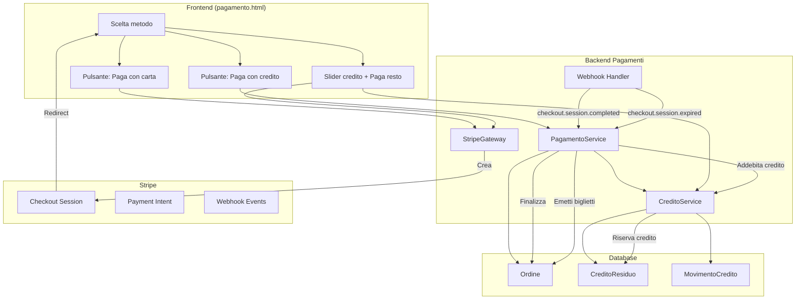
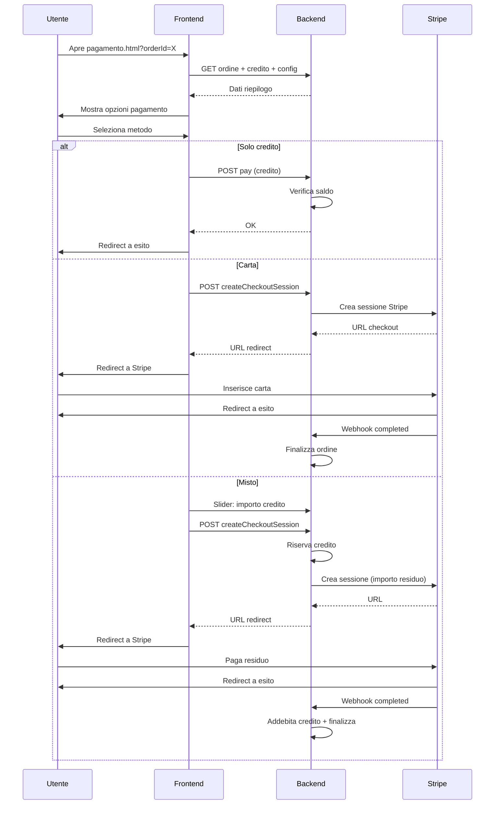
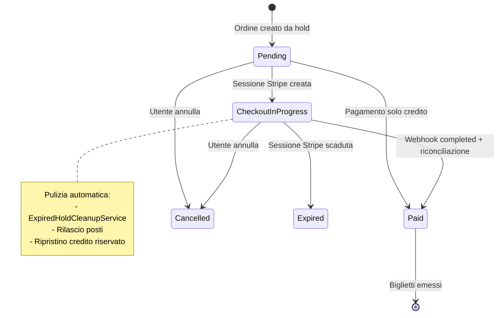

# Pagamenti

## Panoramica

CineBase supporta tre modalità di pagamento: solo credito interno, solo carta tramite Stripe Checkout hosted, o pagamento misto che combina credito e carta.

---

## Tabella Comparativa Metodi di Pagamento

| Caratteristica | Solo Credito | Solo Carta | Misto (Credito + Carta) |
|----------------|-------------|------------|------------------------|
| Richiede Stripe | No | Sì | Sì (solo per la parte carta) |
| Redirect a Stripe | No | Sì | Sì |
| Tempo di completamento | Immediato | 1-3 minuti | 1-3 minuti |
| Commissioni Stripe | Nessuna | Sì | Solo sulla quota carta |
| Addebito immediato | Sì | No (attesa webhook) | No (attesa webhook) |
| Rischio doppio pagamento | Nessuno | Gestito da idempotenza | Gestito da idempotenza |
| Rimborsabile | Sì (admin) | Sì (tramite Stripe) | Sì (credito + Stripe) |

---

## Architettura dei Pagamenti



---

## Flusso Pagamento Completo



---

## Tabella Webhook Stripe Gestiti

| Evento Stripe | Azione Backend | Stato Ordine Finale |
|---------------|----------------|---------------------|
| `checkout.session.completed` | Finalizza ordine, addebita credito riservato, emetti biglietti, invia email | Paid |
| `checkout.session.expired` | Rilascia posti, ripristina credito riservato | Expired |
| `payment_intent.payment_failed` | Logga errore su LastPaymentError | CheckoutInProgress (se hosted) o Failed |
| `payment_intent.canceled` | Logga cancellazione | CheckoutInProgress o Cancelled |

---

## Gestione Transizioni di Stato Ordine



---

## Endpoint Backend Pagamento

| Metodo | Endpoint | Auth | Descrizione |
|--------|----------|------|-------------|
| POST | `/checkout/orders/{orderId}/pay` | Authenticated | Paga ordine con credito |
| POST | `/checkout/orders/{orderId}/stripe-checkout-session` | Authenticated | Crea sessione Stripe Checkout |
| GET | `/checkout/orders/{orderId}/checkout-status` | Authenticated | Stato sessione Stripe |
| POST | `/checkout/orders/{orderId}/reconcile-checkout-session` | Authenticated | Riconcilia ordine dopo Stripe |
| POST | `/payments/stripe/webhook` | AllowAnonymous | Webhook Stripe (firmato) |
| GET | `/credito/me` | Authenticated | Saldo e movimenti credito |
| GET | `/config/frontend` | AllowAnonymous | Publishable key Stripe |

---

## Tabella Sicurezza Pagamenti

| Rischio | Mitigazione |
|---------|-------------|
| Doppio pagamento | `IdempotencyKey` su tutta la pipeline, stato `Paid` bloccante |
| Redirect di ritorno non affidabile | Backend come source of truth, webhook come conferma principale |
| Sessione Stripe abbandonata | `ExpiredHoldCleanupService` pulisce ordini CheckoutInProgress scaduti |
| Credito non addebitato | Riservato al momento della creazione sessione, addebitato solo a webhook completed |
| Concorrenza pagamenti | Lock d'ordine impedisce pagamenti concorrenti |
| Webhook duplicati | Idempotenza sull'evento Stripe (event ID) |
| Back button da Stripe | Riconciliazione automatica, se ancora CheckoutInProgress → cancella ordine |

---

## Blocchi di Codice Commentati

### Gestione Webhook Stripe (idempotenza)

```csharp
// backend/FilmAPI/Services/PagamentoService.cs
// Pattern: gestione webhook con idempotenza
// Stripe invia lo stesso evento più volte; il codice deve gestirlo in modo sicuro.

public async Task HandleStripeWebhookAsync(string jsonBody, string stripeSignature)
{
    // 1. Verifica che il webhook sia autentico (firmato da Stripe)
    var stripeEvent = _stripeGateway.ConstructWebhookEvent(jsonBody, stripeSignature);

    // 2. Route per tipo evento
    switch (stripeEvent.Type)
    {
        case EventTypes.CheckoutSessionCompleted:
            // Pagamento riuscito: finalizza ordine
            var session = stripeEvent.Data.Object as Session;
            await HandleCheckoutCompletedAsync(session.Id);
            break;

        case EventTypes.CheckoutSessionExpired:
            // Sessione scaduta: rilascia posti e credito
            var expiredSession = stripeEvent.Data.Object as Session;
            await HandleCheckoutExpiredAsync(expiredSession.Id);
            break;
    }
}

private async Task HandleCheckoutCompletedAsync(string sessionId)
{
    // Cerca ordine per StripeCheckoutSessionId
    var ordine = await _db.Ordini.FirstOrDefaultAsync(o =>
        o.StripeCheckoutSessionId == sessionId);

    if (ordine == null) return;  // Evento non nostro, ignora

    // IDEMPOTENZA: se già Paid, non fare nulla
    if (ordine.Stato == OrdineState.Paid) return;

    // Addebita credito riservato (se pagamento misto)
    if (ordine.CreditoRiservato > 0)
        await _creditoService.DebitaCreditoAsync(ordine.UserId,
            ordine.CreditoRiservato, ordine.Id);

    // Finalizza: stato Paid, biglietti, email
    ordine.Stato = OrdineState.Paid;
    ordine.PaidAtUtc = DateTime.UtcNow;
    await _bigliettoService.EmittiBigliettiAsync(ordine.Id);
    await _emailService.InviaTicketEmailAsync(ordine); // best-effort

    await _db.SaveChangesAsync();
}
```

### Servizio Credito con Audit Trail

```csharp
// backend/FilmAPI/Services/CreditoService.cs
// Pattern: ogni movimento di credito viene tracciato con audit

public async Task<decimal> ReserveOrderCreditAsync(int userId, decimal importo, int ordineId)
{
    var user = await _db.Users.FindAsync(userId);

    if (user.CreditoResiduo < importo)
        throw new BadRequestException("Credito insufficiente");

    // Riserva: scaliamo subito il credito
    user.CreditoResiduo -= importo;

    // Audit: registriamo il movimento
    _db.MovimentiCredito.Add(new MovimentoCredito
    {
        UserId = userId,
        Tipo = MovimentoCreditoTipo.DebitOrder,
        Importo = importo,
        SaldoPre = user.CreditoResiduo + importo,  // saldo prima
        SaldoPost = user.CreditoResiduo,             // saldo dopo
        OrdineId = ordineId,
        CreatedAtUtc = DateTime.UtcNow,
        Note = $"Riservato per ordine #{ordineId}"
    });

    await _db.SaveChangesAsync();
    return user.CreditoResiduo;
}
```
