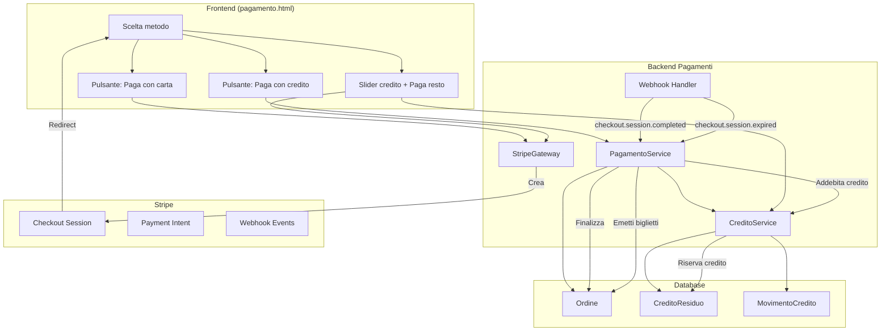
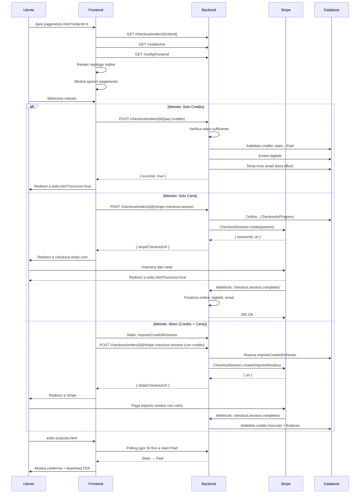
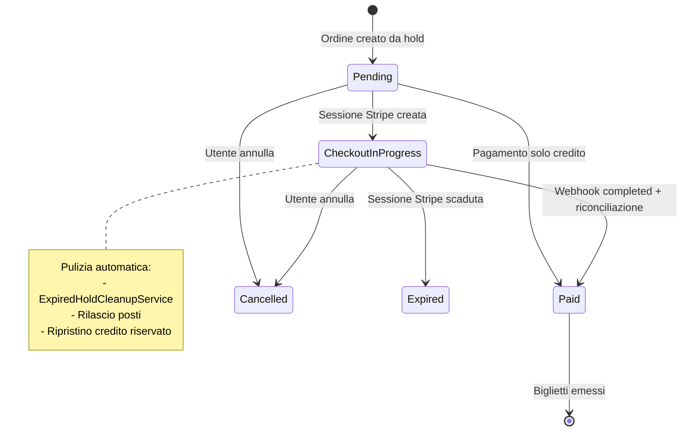

# Pagamenti

## Panoramica

CineBase supporta tre modalità di pagamento: solo credito interno, solo carta tramite Stripe Checkout hosted, o pagamento misto che combina credito e carta.

---

## Tabella Comparativa Metodi di Pagamento

| Caratteristica | Solo Credito | Solo Carta | Misto (Credito + Carta) |
|----------------|-------------|------------|------------------------|
| Richiede Stripe | No | Sì | Sì (solo per la parte carta) |
| Redirect a Stripe | No | Sì | Sì |
| Tempo di completamento | Immediato | 1-3 minuti | 1-3 minuti |
| Commissioni Stripe | Nessuna | Sì | Solo sulla quota carta |
| Addebito immediato | Sì | No (attesa webhook) | No (attesa webhook) |
| Rischio doppio pagamento | Nessuno | Gestito da idempotenza | Gestito da idempotenza |
| Rimborsabile | Sì (admin) | Sì (tramite Stripe) | Sì (credito + Stripe) |

---

## Architettura dei Pagamenti

---

## Flusso Pagamento Completo

---

## Tabella Webhook Stripe Gestiti

| Evento Stripe | Azione Backend | Stato Ordine Finale |
|---------------|----------------|---------------------|
| `checkout.session.completed` | Finalizza ordine, addebita credito riservato, emetti biglietti, invia email | Paid |
| `checkout.session.expired` | Rilascia posti, ripristina credito riservato | Expired |
| `payment_intent.payment_failed` | Logga errore su LastPaymentError | CheckoutInProgress (se hosted) o Failed |
| `payment_intent.canceled` | Logga cancellazione | CheckoutInProgress o Cancelled |

---

## Gestione Transizioni di Stato Ordine

---

## Endpoint Backend Pagamento

| Metodo | Endpoint | Auth | Descrizione |
|--------|----------|------|-------------|
| POST | `/checkout/orders/{orderId}/pay` | Authenticated | Paga ordine con credito |
| POST | `/checkout/orders/{orderId}/stripe-checkout-session` | Authenticated | Crea sessione Stripe Checkout |
| GET | `/checkout/orders/{orderId}/checkout-status` | Authenticated | Stato sessione Stripe |
| POST | `/checkout/orders/{orderId}/reconcile-checkout-session` | Authenticated | Riconcilia ordine dopo Stripe |
| POST | `/payments/stripe/webhook` | AllowAnonymous | Webhook Stripe (firmato) |
| GET | `/credito/me` | Authenticated | Saldo e movimenti credito |
| GET | `/config/frontend` | AllowAnonymous | Publishable key Stripe |

---

## Tabella Sicurezza Pagamenti

| Rischio | Mitigazione |
|---------|-------------|
| Doppio pagamento | `IdempotencyKey` su tutta la pipeline, stato `Paid` bloccante |
| Redirect di ritorno non affidabile | Backend come source of truth, webhook come conferma principale |
| Sessione Stripe abbandonata | `ExpiredHoldCleanupService` pulisce ordini CheckoutInProgress scaduti |
| Credito non addebitato | Riservato al momento della creazione sessione, addebitato solo a webhook completed |
| Concorrenza pagamenti | Lock d'ordine impedisce pagamenti concorrenti |
| Webhook duplicati | Idempotenza sull'evento Stripe (event ID) |
| Back button da Stripe | Riconciliazione automatica, se ancora CheckoutInProgress → cancella ordine |
