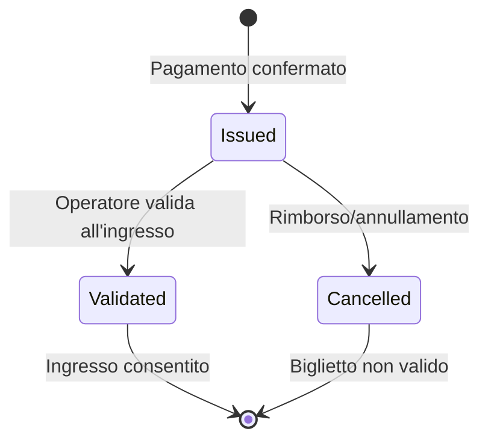
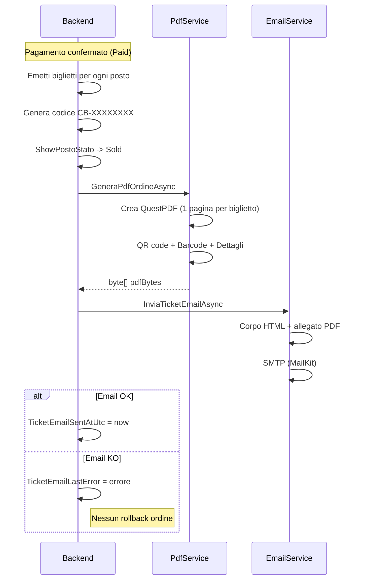
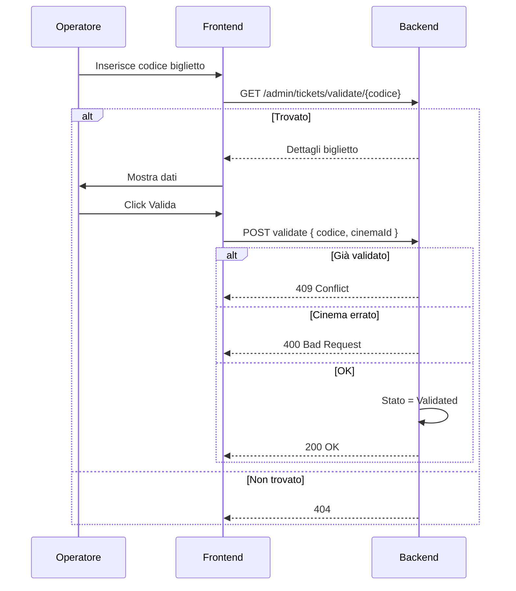

# Ticketing Digitale

## Panoramica

Il sistema di ticketing digitale copre l'intero ciclo di vita del biglietto: emissione automatica al pagamento, generazione PDF multipagina con QR code, invio email e validazione all'ingresso.

---

## Ciclo di Vita del Biglietto



### Tabella Stati Biglietto

| Stato | Valore | Descrizione | Azioni Possibili |
|-------|--------|-------------|------------------|
| Issued | 0 | Emesso, in attesa di utilizzo | Validazione, download PDF |
| Validated | 1 | Già utilizzato per l'ingresso | Solo visualizzazione |
| Cancelled | 2 | Annullato o rimborsato | Nessuna |

---

## Flusso di Emissione Completo



---

## Struttura del PDF (QuestPDF)

### Contenuto di Ogni Pagina

| Sezione | Contenuto | Tecnologia |
|---------|-----------|------------|
| Intestazione | Logo CineBase, titolo "Biglietto Cinema" | QuestPDF layout |
| QR Code | Dati biglietto codificati | QRCoder |
| Informazioni film | Titolo, durata, descrizione breve | QuestPDF text |
| Informazioni cinema | Nome cinema, indirizzo, sala | QuestPDF text |
| Data e ora | Data spettacolo formattata it-IT | QuestPDF text |
| Posto | Settore, fila, numero | QuestPDF text |
| Codice biglietto | CB-XXXXXXXX (font monospace) | QuestPDF text |
| Prezzo | Formattato €X.XX | QuestPDF text |
| Barcode | Barcode grafico 1D | ZXing.Net |
| Piè di pagina | Condizioni di validità | QuestPDF text |

---

## Invio Email (MailKit)

### Tabella Provider Supportati

| Provider | Host | Porta | TLS | Autenticazione |
|----------|------|-------|-----|----------------|
| Google SMTP | smtp.gmail.com | 587 | Sì | OAuth2 / App Password |
| Twilio SendGrid | smtp.sendgrid.net | 587 | Sì | API Key |

### Configurazione .env

```env
SMTP_HOST=smtp.gmail.com
SMTP_PORT=587
SMTP_USER=mittente@gmail.com
SMTP_PASSWORD=password_app_16_caratteri
SMTP_FROM_EMAIL=noreply@cinebase.it
SMTP_FROM_NAME=CineBase
```

### Architettura Provider-Agnostic

```csharp
public interface IEmailService {
    Task SendTicketEmailAsync(
        string to,              // Email destinatario
        string subject,         // Oggetto email
        string htmlBody,        // Corpo HTML
        byte[] pdfAttachment,   // PDF allegato
        string pdfFileName      // Nome file PDF
    );
}

// Implementazione reale: EmailService (MailKit)
// Fake per test: FakeEmailService (sostituito in DI)
```

---

## Validazione Biglietti



### Regole di Validazione

| Condizione | Codice HTTP | Messaggio |
|------------|-------------|-----------|
| Codice inesistente | 404 | Biglietto non trovato |
| Già validato | 409 | Biglietto già validato il [data] |
| Cinema non corrispondente | 400 | Questo biglietto non è per questo cinema |
| Biglietto annullato | 400 | Biglietto annullato |
| Validazione riuscita | 200 | Ingresso consentito |

---

## Endpoint Backend Ticketing

| Metodo | Endpoint | Auth | Descrizione |
|--------|----------|------|-------------|
| GET | `/checkout/orders/{orderId}/pdf` | Authenticated | Download PDF dell'ordine |
| GET | `/admin/tickets/validate/{code}` | PowerUserOrAdmin | Ricerca biglietto per codice |
| POST | `/admin/tickets/validate` | PowerUserOrAdmin | Convalida biglietto all'ingresso |

---

## Servizi Backend

| Servizio | Metodi Principali |
|----------|-------------------|
| `IBigliettoService` | `EmittiBigliettiAsync`, `GetBigliettiByOrdineAsync`, `GetBigliettoByCodiceAsync` |
| `IPdfService` | `GeneraPdfOrdineAsync` |
| `IEmailService` | `SendTicketEmailAsync` |
| `IValidazioneBigliettoService` | `LookupBigliettoAsync`, `ValidaBigliettoAsync` |

---

## Blocchi di Codice Commentati

### Servizio di Validazione Biglietti (pattern importante)

```csharp
// backend/FilmAPI/Services/ValidazioneBigliettoService.cs
// Pattern: validazione con regole multiple e audit

public async Task<ValidazioneResultDTO> ValidaBigliettoAsync(string codice, int cinemaId, int operatoreId)
{
    // 1. Cerca il biglietto per codice univoco
    var biglietto = await _db.Biglietti
        .Include(b => b.Show).ThenInclude(s => s.Cinema)
        .Include(b => b.SalaPosto)
        .FirstOrDefaultAsync(b => b.CodiceBiglietto == codice);

    if (biglietto == null)
        return new ValidazioneResultDTO
        {
            Esito = "KO",
            Messaggio = "Biglietto non trovato",
            CodiceHttp = 404
        };

    // 2. Controlla se già validato (doppia validazione bloccata)
    if (biglietto.Stato == BigliettoState.Validated)
        return new ValidazioneResultDTO
        {
            Esito = "KO",
            Messaggio = $"Biglietto già validato il {biglietto.ValidatoAtUtc:dd/MM/yyyy HH:mm}",
            CodiceHttp = 409
        };

    // 3. Controlla che il cinema corrisponda
    if (biglietto.Show.CinemaId != cinemaId)
        return new ValidazioneResultDTO
        {
            Esito = "KO",
            Messaggio = "Questo biglietto non è per questo cinema",
            CodiceHttp = 400
        };

    // 4. Se tutti i controlli passano, valida
    biglietto.Stato = BigliettoState.Validated;
    biglietto.ValidatoAtUtc = DateTime.UtcNow;
    biglietto.ValidatoDaUserId = operatoreId;
    biglietto.ValidatoCinemaId = cinemaId;

    await _db.SaveChangesAsync();

    return new ValidazioneResultDTO
    {
        Esito = "OK",
        Messaggio = "Ingresso consentito",
        CodiceHttp = 200,
        Biglietto = MapToDTO(biglietto)
    };
}
```

### Pattern di Idempotenza (fondamentale per pagamenti)

```csharp
// backend/FilmAPI/Services/PagamentoService.cs
// Pattern: idempotenza per evitare doppi pagamenti

public async Task<OrdineSummaryDTO> PayCreditoAsync(int userId, int ordineId,
    decimal importoCredito, string idempotencyKey)
{
    using var tx = await _db.Database.BeginTransactionAsync();

    // 1. IDEMPOTENZA: se stessa chiave già usata, restituisci risultato esistente
    var existing = await _db.Ordini
        .FirstOrDefaultAsync(o => o.IdempotencyKey == idempotencyKey);
    if (existing != null)
        return MapToSummary(existing);

    // 2. LEGACY CHECK: se ordine già pagato, non procedere
    var ordine = await _db.Ordini.FindAsync(ordineId);
    if (ordine.Stato == OrdineState.Paid)
        throw new ConflictException("Ordine già pagato");

    // 3. TRANSAZIONE: addebita e finalizza
    ordine.Stato = OrdineState.Paid;
    ordine.ImportoCredito = importoCredito;
    ordine.IdempotencyKey = idempotencyKey;
    ordine.PaidAtUtc = DateTime.UtcNow;

    // 4. Emetti biglietti (operazione interna, senza rollback)
    await _bigliettoService.EmittiBigliettiAsync(ordine.Id);

    await _db.SaveChangesAsync();
    await tx.CommitAsync();

    return MapToSummary(ordine);
}
```

## Librerie Utilizzate

| Libreria | Versione | Utilizzo |
|----------|----------|----------|
| QuestPDF | 2024.x | Generazione PDF multipagina |
| QRCoder | 1.x | Codici QR per ogni biglietto |
| ZXing.Net | 0.16.x | Barcode grafico 1D |
| MailKit | 4.x | Client SMTP per invio email |
| PdfPig | — | Lettura PDF nei test di integrazione |
