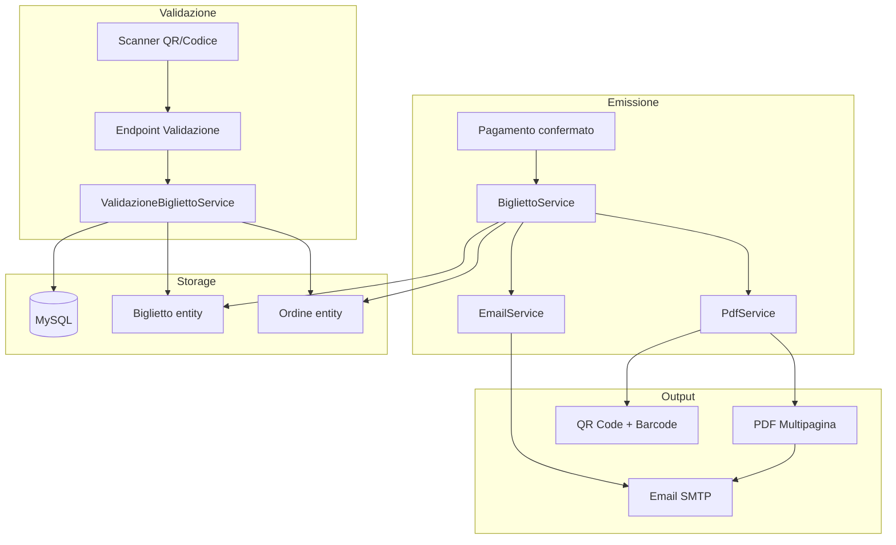
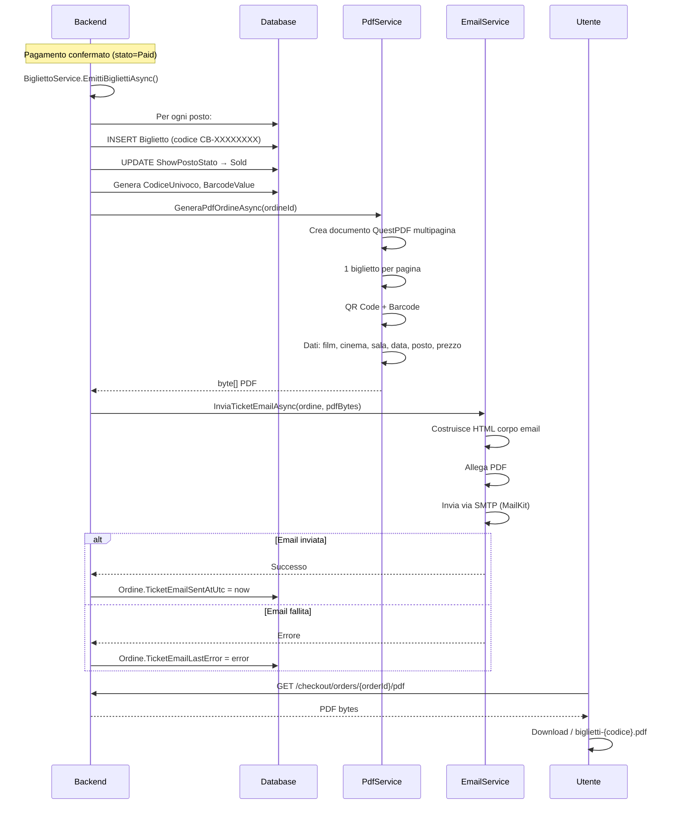
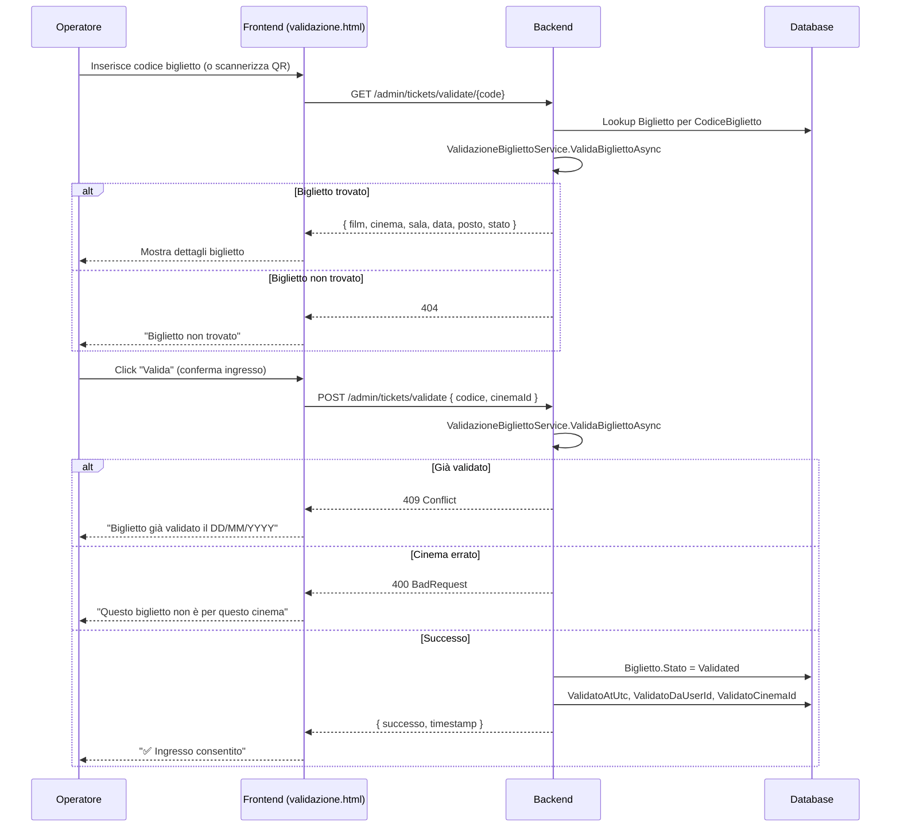

# Ticketing Digitale

## Panoramica

Il sistema di ticketing digitale copre l'intero ciclo di vita del biglietto: dall'emissione alla validazione, passando per PDF, email e QR code.

---

## Architettura del Ticketing



---

## Flusso di Emissione Biglietti



---

## Generazione PDF (QuestPDF)

Il PDF viene generato con **QuestPDF** (libreria C# per PDF, licenza community).

### Struttura del PDF Multipagina

```
┌──────────────────────────────────────┐
│          BIGLIETTO CINEMA            │
│  ┌──────────────────────────────┐    │
│  │         QR CODE              │    │
│  │     ██ ▄▄▄ ██ ▄▄▄           │    │
│  │     ▄▄█ █ ▄▄▄█▄▄            │    │
│  └──────────────────────────────┘    │
│                                      │
│  CineBase - La Tua Rete Cinematogr.  │
│                                      │
│  Film:      Il Padrino               │
│  Cinema:    Roma Moderno             │
│  Sala:      Sala 3 - ISENSE          │
│  Data:      mer 25/05/2026           │
│  Orario:    21:00                    │
│                                      │
│  Posto:     PLATEA CENTRO - Fila 8   │
│  Posto n:   12                       │
│                                      │
│  Codice:    CB-A1B2C3D4              │
│  Prezzo:    14,50 €                  │
│  ──────────────────────────────      │
│  ▌▌▌▌▌▌ BARCODE ▌▌▌▌▌▌             │
└──────────────────────────────────────┘
        (una pagina per biglietto)
```

### Dipendenze

```xml
<PackageReference Include="QuestPDF" Version="2024.*" />
<PackageReference Include="QRCoder" Version="1.*" />
<PackageReference Include="ZXing.Net" Version="0.16.*" />
```

---

## Invio Email (MailKit)

### Provider Supportati

| Provider | Configurazione | Tipo |
|----------|---------------|------|
| **Google SMTP** | `smtp.gmail.com:587`, TLS, OAuth2/App Password | Baseline operativa |
| **Twilio SendGrid** | `smtp.sendgrid.net:587`, TLS, API Key | Alternativa documentata |

### Configurazione `.env`

```env
SMTP_HOST=smtp.gmail.com
SMTP_PORT=587
SMTP_USER=your-email@gmail.com
SMTP_PASSWORD=your-app-password
SMTP_FROM_EMAIL=noreply@cinebase.it
SMTP_FROM_NAME=CineBase
```

### Architettura Provider-Agnostic

```csharp
public interface IEmailService {
    Task SendTicketEmailAsync(string to, string subject, string htmlBody, byte[] pdfAttachment, string pdfFileName);
}

// Implementazione concreta: EmailService (MailKit)
// Fake per test: sostituito in CustomWebApplicationFactory
```

---

## Validazione Biglietti



### Regole di Validazione

| Regola | Comportamento |
|--------|---------------|
| Biglietto non trovato | 404 Not Found |
| Biglietto già validato | 409 Conflict + data validazione |
| Cinema non corrispondente | 400 Bad Request |
| Biglietto annullato | 400 Bad Request |
| Biglietto emesso e valido | ✅ Validazione OK |

---

## Endpoint Backend Ticketing

| Metodo | Endpoint | Auth | Descrizione |
|--------|----------|------|-------------|
| `GET` | `/checkout/orders/{orderId}/pdf` | Authenticated | Download PDF ordine |
| `GET` | `/admin/tickets/validate/{code}` | PowerUserOrAdmin | Lookup biglietto per codice |
| `POST` | `/admin/tickets/validate` | PowerUserOrAdmin | Valida biglietto (conferma ingresso) |

### Servizi Backend

| Servizio | Metodi Principali |
|----------|-------------------|
| `IBigliettoService` | `EmittiBigliettiAsync`, `GetBigliettiByOrdineAsync`, `GetBigliettoByCodiceAsync` |
| `IPdfService` | `GeneraPdfOrdineAsync` |
| `IEmailService` | `SendTicketEmailAsync` |
| `IValidazioneBigliettoService` | `LookupBigliettoAsync`, `ValidaBigliettoAsync` |
