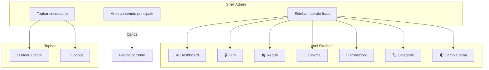

# Pannello Amministrativo

## Panoramica

L'area admin offre una shell unificata per tutte le operazioni di gestione: CRUD di film, registi, sale, show, categorie, utenti e credito, con paginazione server-side e ricerca testuale su tutte le liste.

---

## Tabella delle Pagine Admin

| Pagina | URL | File JS | Ruolo Minimo | CRUD | API Chiamate |
|--------|-----|---------|-------------|------|--------------|
| Dashboard | `dashboard.html` | — | PowerUser | Lettura | `getProiezioni` |
| Film | `films.html` | `films.js` | PowerUser | C/U/D | `/films`, `/registi`, `/categorie`, `/tmdb/search` |
| Registi | `registi.html` | `registi.js` | PowerUser | C/U/D | `/registi` |
| Cinema | `cinemas.html` | `cinemas.js` | Admin (delete) | C/U/D | `/cinemas` |
| Proiezioni | `proiezioni.html` | `proiezioni.js` | PowerUser | C/U/D | `/proiezioni`, `/shows` |
| Categorie | `categorie.html` | `categorie.js` | PowerUser | C/U/D | `/categorie` |
| Sale | (nuovo) | — | PowerUser | C/U/D | `/sale`, `/cinemas/{id}/sale` |
| Show | (da proiezioni) | — | PowerUser | C/U/D | `/shows` |
| Utenti | `utenti.html` | `utenti.js` | Admin | Lettura/Ruolo/Credito | `/admin/utenti` |
| Utente Dettaglio | `utenti-detail.html` | `utenti-detail.js` | Admin | Lettura/Modifica | `/admin/utenti/{id}` |
| Validazione | `validazione.html` | `validazione.js` | PowerUser | Validazione | `/admin/tickets/validate` |

---

## Shell Admin Unificata (admin-shell.js)



| Componente | Descrizione |
|------------|-------------|
| Sidebar | Navigazione principale, link attivo evidenziato, toggle mobile |
| Topbar | Menu utente, cambio tema (solo sidebar), logout |
| Content | Area centrale dove viene caricata la pagina |

---

## Matrice CRUD Admin

| Entità | Crea | Leggi | Aggiorna | Elimina | Note |
|--------|------|-------|----------|---------|------|
| Film | PowerUser+ | Pubblico | PowerUser+ | PowerUser+ | Con categorie many-to-many |
| Regista | PowerUser+ | Pubblico | PowerUser+ | PowerUser+ | — |
| Cinema | PowerUser+ | Pubblico | PowerUser+ | Admin Only | Blocco se esistono sale/show |
| Sala | PowerUser+ | Pubblico | PowerUser+ | PowerUser+ | Blocco se show futuri o biglietti |
| Show | PowerUser+ | Pubblico | PowerUser+ | PowerUser+ | Anti-overlap validato |
| Categoria | PowerUser+ | Pubblico | PowerUser+ | PowerUser+ | — |
| Proiezione (legacy) | PowerUser+ | Pubblico | PowerUser+ | PowerUser+ | Bridge verso Show |
| Utente | Solo registro | Admin | Admin | — | Solo disabilita, non elimina |
| Credito | Admin (ricarica) | User (proprio) | Admin | — | Con audit trail |

---

## Paginazione Server-Side

```mermaid
flowchart TD
    A[Frontend: richiede /registi?page=2&pageSize=10&search=test] --> B{Backend: page e pageSize presenti?}
    B -->|Sì| C[RegistaService.GetPagedAsync]
    C --> D[Query con Skip/Take + filtro search]
    D --> E[DTO paginato: Items, TotalCount, HasNextPage]
    E --> F[Frontend: render tabella + controlli pagina]
    
    B -->|No| G[Fallback legacy: GetAllAsync]
    G --> H[Risposta array semplice]

    F --> I[Utente clicca "Avanti"]
    I --> A
```

### DTO Paginato

```csharp
public class RegistaPagedResultDTO {
    public List<RegistaDTO> Items { get; set; }    // Elementi della pagina
    public int TotalCount { get; set; }             // Totale elementi (tutte le pagine)
    public int Page { get; set; }                   // Pagina corrente
    public int PageSize { get; set; }               // Elementi per pagina
    public bool HasNextPage { get; set; }           // True se ci sono altre pagine
}
```

### Pagine con Paginazione

| Pagina | Endpoint | Parametri | Page Size Default |
|--------|----------|-----------|-------------------|
| Registi | `GET /registi` | `page, pageSize, search` | 10 |
| Cinema | `GET /cinemas` | `page, pageSize, search` | 10 |
| Proiezioni | `GET /proiezioni` | `page, pageSize, search` | 10 |

---

## Endpoint Backend Admin

| Metodo | Endpoint | Auth | Descrizione |
|--------|----------|------|-------------|
| GET | `/films` | AllowAnonymous | Lista film paginata con ricerca |
| POST | `/films` | PowerUserOrAdmin | Crea film |
| PUT | `/films/{id}` | PowerUserOrAdmin | Aggiorna film |
| DELETE | `/films/{id}` | PowerUserOrAdmin | Elimina film |
| GET | `/registi` | AllowAnonymous | Lista registi paginata |
| POST | `/registi` | PowerUserOrAdmin | Crea regista |
| PUT | `/registi/{id}` | PowerUserOrAdmin | Aggiorna regista |
| DELETE | `/registi/{id}` | PowerUserOrAdmin | Elimina regista |
| GET | `/cinemas` | AllowAnonymous | Lista cinema paginata |
| POST | `/cinemas` | PowerUserOrAdmin | Crea cinema |
| DELETE | `/cinemas/{id}` | AdminOnly | Elimina cinema |
| GET | `/cinemas/{cinemaId}/sale` | AllowAnonymous | Lista sale per cinema |
| POST | `/cinemas/{cinemaId}/sale` | PowerUserOrAdmin | Crea sala |
| PUT | `/sale/{salaId}/posti` | PowerUserOrAdmin | Salva piantina posti |
| GET | `/shows` | AllowAnonymous | Lista show con filtri |
| POST | `/shows` | PowerUserOrAdmin | Crea show |
| PUT | `/shows/{id}` | PowerUserOrAdmin | Aggiorna show |
| DELETE | `/shows/{id}` | PowerUserOrAdmin | Elimina show |
| GET | `/categorie` | AllowAnonymous | Lista categorie |
| POST | `/categorie` | PowerUserOrAdmin | Crea categoria |
| DELETE | `/categorie/{id}` | PowerUserOrAdmin | Elimina categoria |
| GET | `/admin/utenti` | AdminOnly | Lista utenti |
| PUT | `/admin/utenti/{id}/ruolo` | AdminOnly | Cambia ruolo utente |
| PUT | `/admin/utenti/{id}` | AdminOnly | Modifica profilo utente |
| POST | `/admin/credito/ricarica` | AdminOnly | Ricarica credito admin |
| GET | `/admin/tickets/validate/{code}` | PowerUserOrAdmin | Ricerca biglietto |

---

## Servizi Backend Admin

| Servizio | Metodi Principali |
|----------|-------------------|
| `IFilmService` | `GetAllAsync`, `GetPagedAsync`, `GetByIdAsync`, `CreateAsync`, `UpdateAsync`, `DeleteAsync` |
| `IRegistaService` | `GetAllAsync`, `GetPagedAsync`, `CreateAsync`, `UpdateAsync`, `DeleteAsync` |
| `ICinemaService` | `GetAllAsync`, `GetPagedAsync`, `CreateAsync`, `UpdateAsync`, `DeleteAsync` |
| `IShowService` | CRUD con validazione anti-overlap |
| `ISalaService` | CRUD sale + gestione piantina posti (replace-all) |
| `ICategoriaService` | CRUD categorie |
| `IUserAdminService` | Lista utenti, cambio ruolo, disabilita |
| `ICreditoService` | Saldo, movimenti, ricarica admin |
