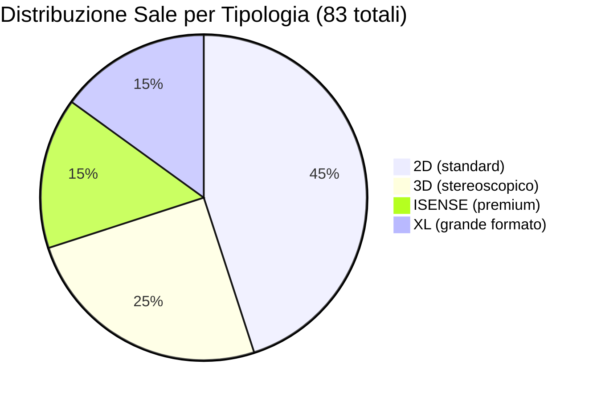

# Seed Dati Realistico

## Panoramica

CineBase include un progetto console standalone chiamato `FilmApiSeeder` che popola il database con dati reali e credibili utilizzando l'API TMDB per film, copertine e cast, e generando proceduralmente cinema, sale e programmazione.

---

## Struttura del Progetto

```
backend/scripts/FilmApiSeeder/
├── FilmApiSeeder.csproj    # Progetto console .NET 8
├── Program.cs              # Orchestratore: reset, seed, opzioni CLI
├── TmdbClient.cs           # Client HTTP per TMDB API v3
└── SeedCatalog.cs          # Catalogo: film, cinema, categorie, sale
```

---

## Flusso di Seed

```mermaid
flowchart TD
    A[Esecuzione FilmApiSeeder] --> B[Legge backend/.env]

    B --> C{Flag --reset-shows o --reset-all?}
    C -->|--reset-shows| D[Elimina solo: Shows, ShowPostiStato, Ordini, Biglietti]
    C -->|--reset-all| E[Elimina TUTTI i dati seedati]
    C -->|nessun flag| F[Aggiunge incrementalmente]

    D --> G[Seed Categorie generiche]
    E --> G
    F --> G

    G --> H[Seed Registi reali]
    H --> I[Per ogni film del catalogo]
    I --> I1[TMDB.SearchMovieAsync(titolo)]
    I1 --> I2[TmdbClient.GetMovieDetailAsync(tmdbId)]
    I2 --> I3[Salva: titolo, descrizione, cast, copertina, voti]

    I3 --> J[Seed Cinema italiani]
    J --> K[Per ogni cinema: crea 3-5 sale]
    K --> L[Per ogni sala: genera piantina posti]

    L --> M[Genera Shows per i prossimi 7-14 giorni]
    M --> N[Verifica finale]
    N --> O[Seed completato con successo]
```

---

## Tabella Dati Seedati

| Entità | Quantità | Dettaglio |
|--------|----------|-----------|
| Film | 64 | Importati da TMDB con cast, copertine, voti |
| Categorie | 12 | Azione, Commedia, Drammatico, Horror, Fantascienza, Thriller, Animazione, Documentario, Avventura, Romantico, Musicale, Western |
| Registi | ~40 | Registi reali associati ai film |
| Cinema | 20 | Cinema in città italiane con coordinate geografiche |
| Sale | 83 | 3-5 sale per cinema, tipologie miste (2D, 3D, ISENSE, XL) |
| Posti | ~10.000 | Generati proceduralmente per ogni sala |
| Shows | ~500 | Programmazione distribuita su 7-14 giorni |

---

## Tabella Cinema Italiani Seedati

| Cinema | Città | Sale | Tipologie |
|--------|-------|------|-----------|
| Roma Moderno | Roma | 5 | 2D, 3D, ISENSE, XL |
| Milano Duomo | Milano | 5 | 2D, 3D, ISENSE, XL |
| Napoli Centro | Napoli | 4 | 2D, 3D, ISENSE |
| Torino Matrix | Torino | 4 | 2D, 3D, XL |
| Firenze Aurora | Firenze | 4 | 2D, 3D, ISENSE |
| Bologna | Bologna | 4 | 2D, 3D, XL |
| ... (altri 14) | ... | ... | ... |

---

## Distribuzione Tipologie Sala



---

## Piantina Posti Generata

Ogni sala ha una piantina generata proceduralmente con:

| Parametro | Valore | Descrizione |
|-----------|--------|-------------|
| Settori | Platea-Centro, Platea-SX, Platea-DX | Settori principali |
| Settori aggiuntivi | Galleria, Accessibilità | Opzionale per sale grandi |
| File per settore | 6-12 | Numero variabile per dimensione sala |
| Posti per fila | 8-15 | Dipende dalla capienza |
| Posti wheelchair | 1-3 per settore | Contrassegnati con IsWheelchair=true |
| Coordinate | PosX, PosY | Per rendering sulla mappa |
| Prezzo supplemento | 0-4 € | In base al tipo sala |

---

## Integrazione TMDB

### Metodi del Client

| Metodo | Descrizione |
|--------|-------------|
| `SearchMovieAsync(query)` | Ricerca film per titolo, restituisce risultati TMDB |
| `GetMovieDetailAsync(tmdbId)` | Dettaglio completo: trama, cast, crew, voti |
| `GetPosterUrl(path, size)` | URL poster nella dimensione specificata (w500) |
| `GetBackdropUrl(path, size)` | URL backdrop nella dimensione specificata (w1280) |

### Dati Importati per Ogni Film

| Campo Modello | Fonte TMDB |
|---------------|------------|
| `Titolo` | `original_title` |
| `DescrizioneLunga` | `overview` |
| `CastText` | `credits.cast[0..5].name` (concatenati) |
| `DataRilascio` | `release_date` |
| `CopertinaPath` | `poster_path` |
| `BackdropPath` | `backdrop_path` |
| `VoteAverage` | `vote_average` |
| `VoteCount` | `vote_count` |
| `RegistaId` | `credits.crew[?].job=Director` |
| `TmdbId` | `id` |

---

## Comandi CLI

| Comando | Descrizione | Quando Usarlo |
|---------|-------------|---------------|
| `dotnet run` | Seed incrementale (aggiunge senza cancellare) | Prima esecuzione o dopo reset manuale |
| `dotnet run -- --reset-shows --force` | Cancella solo la programmazione e riesegue il seed | Dopo modifiche alla struttura show |
| `dotnet run -- --reset-all --force` | Cancella tutto e reseed da capo | Dopo modifiche allo schema DB |

---

## Configurazione .env

```env
# Database
DB_CONNECTION_STRING=Server=localhost;Database=cinebase;User=root;Password=...;

# TMDB (obbligatorio per il seeder)
TMDB_BEARER_TOKEN=eyJhbGciOiJIUzI1NiJ9...

# Ticketing (usati anche dal backend)
DEFAULT_TICKET_PRICE=8.50
HOLD_TTL_MINUTES=10
MAX_SEATS_PER_ORDER=10

# Stripe
STRIPE_API_KEY=sk_test_...
STRIPE_WEBHOOK_SECRET=whsec_...

# SMTP
SMTP_HOST=smtp.gmail.com
SMTP_PORT=587
SMTP_USER=noreply@cinebase.it
SMTP_PASSWORD=...
```
