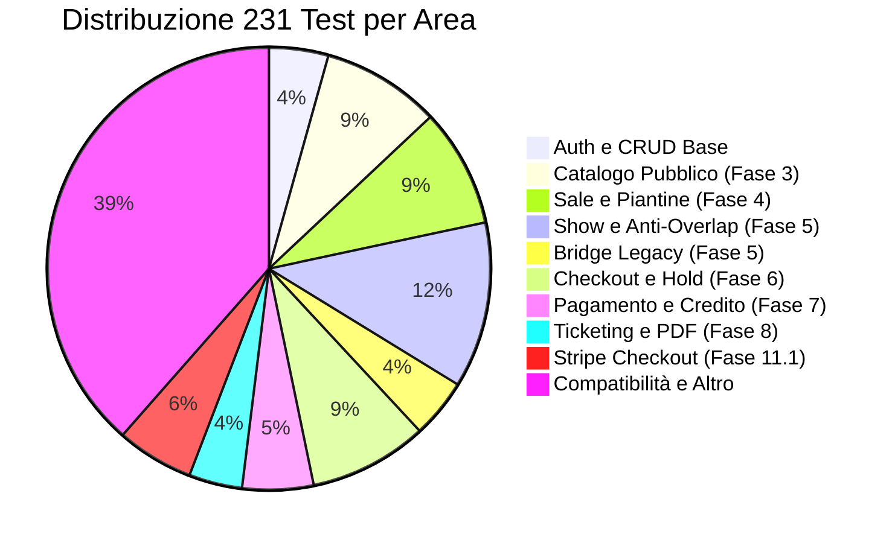
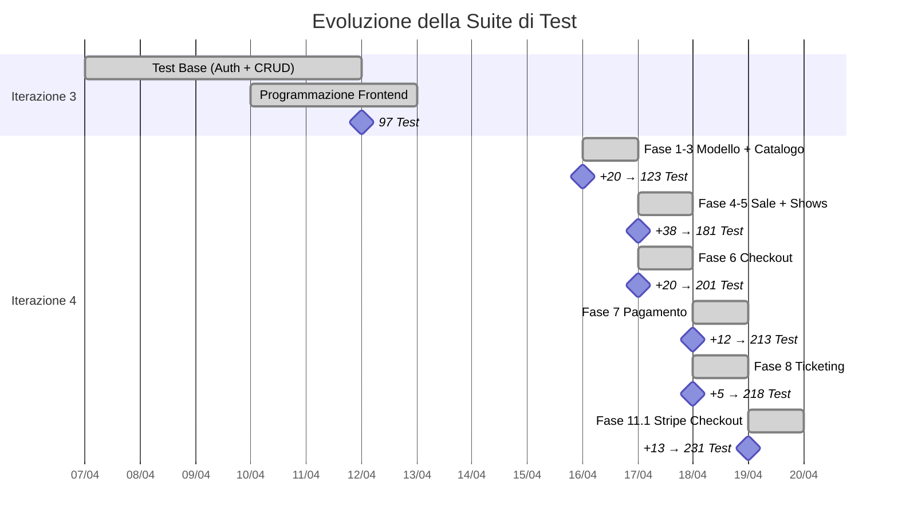

# Test Suite

## Panoramica

CineBase include una suite di test di integrazione backend con **231 test** tutti verdi, che coprono ogni fase dello sviluppo dalla Fase 1 alla Fase 11.1. L'esecuzione completa richiede circa 45 secondi.

---

## Tabella Riepilogativa Test per Area

| Area | File di Test | Numero Test | Copertura |
|------|-------------|-------------|-----------|
| CRUD base e autenticazione | `ApiIntegrationTests.cs` | ~10 | Auth, endpoint base |
| Catalogo pubblico | `ProgrammazioneIntegrationTests.cs` | 20 | Listing, tabs, ricerca, categorie |
| Sale e piantine | `SalaIntegrationTests.cs` | 20 | CRUD sale, piantina posti, validazioni |
| Show e anti-overlap | `ShowIntegrationTests.cs` | 28 | CRUD show, overlap, filtri |
| Bridge legacy proiezioni | `ProiezioneCompatIntegrationTests.cs` | 10 | Compatibilità Proiezione→Show |
| Checkout e hold | `CheckoutIntegrationTests.cs` | 20 | Seat map, hold, concorrenza |
| Pagamento e credito | `PagamentoCreditoIntegrationTests.cs` | ~12 | Carta, credito, misto, webhook |
| Biglietti e PDF | `TicketIntegrationTests.cs` | ~5 | Emissione, PDF content, ownership |
| Validazione biglietti | `ValidazioneTicketIntegrationTests.cs` | 4 | Lookup, doppia validazione, mismatch |
| Stripe Checkout hosted | `CheckoutHostedIntegrationTests.cs` | 13 | Sessione, webhook, riconciliazione |
| **Totale** | **11 file** | **231** | **Tutte le fasi** |

---

## Distribuzione Test per Area Funzionale



---

## Crescita Test nel Tempo



### Tabella Evoluzione

| Data | Fase | Nuovi Test | Totale | Incremento |
|------|------|-----------|--------|------------|
| 2026-04-12 | Fine Iterazione 3 | — | 97 | Base |
| 2026-04-16 | Fase 1-3 | 26 | 123 | +27% |
| 2026-04-17 | Fase 4-5 | 58 | 181 | +47% |
| 2026-04-17 | Fase 6 | 20 | 201 | +11% |
| 2026-04-18 | Fase 7 | 12 | 213 | +6% |
| 2026-04-18 | Fase 8 | 5 | 218 | +2% |
| 2026-04-19 | Fase 11.1 | 13 | 231 | +6% |

---

## Infrastruttura di Test

### CustomWebApplicationFactory

```csharp
public class CustomWebApplicationFactory : WebApplicationFactory<Program> {
    protected override void ConfigureWebHost(IWebHostBuilder builder) {
        // Database InMemory per test isolati
        builder.UseSetting("DB_CONNECTION_STRING",
            "Data Source=:memory:;");

        // Sostituisce servizi reali con implementazioni fake
        builder.ConfigureServices(services => {
            // Stripe: gateway falso
            services.AddScoped<IStripeGateway, FakeStripePaymentGateway>();

            // Email: servizio falso (nessun SMTP reale)
            services.AddScoped<IEmailService, FakeEmailService>();

            // TMDB: client falso (nessuna chiamata HTTP)
            services.AddScoped<ITmdbService, FakeTmdbService>();
        });
    }
}
```

### Servizi Fake Utilizzati

| Servizio Reale | Fake | Comportamento |
|----------------|------|---------------|
| StripeGateway | FakeStripePaymentGateway | Crea sessioni, simula webhook, gestisce stati |
| EmailService | FakeEmailService | Registra chiamate, non invia email reali |
| TmdbService | FakeTmdbService | Restituisce dati film predefiniti |

---

## Esempi di Test

### Test di Concorrenza Hold Posti

```csharp
[Fact]
public async Task CH16_Concorrenza_Hold_Stesso_Posto_Solo_1_Vince() {
    var (client1, _) = await CreateAuthenticatedUserAsync("user1@test.it");
    var (client2, _) = await CreateAuthenticatedUserAsync("user2@test.it");

    var task1 = CreateHoldAsync(client1, showId, new[] { posto1.Id, posto2.Id, posto3.Id });
    var task2 = CreateHoldAsync(client2, showId, new[] { posto3.Id, posto4.Id, posto5.Id });

    await Task.WhenAll(task1, task2);

    var posti1 = (await task1)?.salaPostoIds ?? [];
    var posti2 = (await task2)?.salaPostoIds ?? [];

    // Posto 3 deve finire in UNO SOLO dei due hold
    Assert.True(
        (posti1.Contains(posto3.Id) && !posti2.Contains(posto3.Id)) ||
        (!posti1.Contains(posto3.Id) && posti2.Contains(posto3.Id))
    );
}
```

### Test Pagamento Misto Stripe Checkout

```csharp
[Fact]
public async Task H7_Pagamento_Misto_Credito_Riservato_E_Carta_Stripe() {
    var (client, userId) = await CreateUserWithCreditAsync(20.00m);
    var order = await CreatePendingOrderAsync(client, holdToken);

    var session = await CreateCheckoutSessionAsync(client,
        order.Id, metodoPagamento: "Misto", importoCreditoRichiesto: 5.00);

    Assert.NotNull(session?.stripeCheckoutUrl);
    Assert.NotNull(session?.stripeCheckoutSessionId);

    await SimulateCheckoutCompletedAsync(client, session.stripeCheckoutSessionId);

    var ordineFinale = await GetOrdineAsync(client, order.Id);
    Assert.Equal("Paid", ordineFinale.stato);
    Assert.Equal(5.00m, ordineFinale.importoCredito);
    Assert.Equal(1.25m, ordineFinale.importoCarta); // 6.25 - 5.00
}
```

---

## Comandi Esecuzione

| Comando | Descrizione |
|---------|-------------|
| `dotnet test tests/backend/FilmAPI.Tests.csproj` | Esegue tutti i test |
| `dotnet test ... -v n` | Output dettagliato |
| `dotnet test ... --filter "CH16"` | Esegue test specifico |
| `dotnet test ... -p:CollectCoverage=true` | Con copertura codice |
