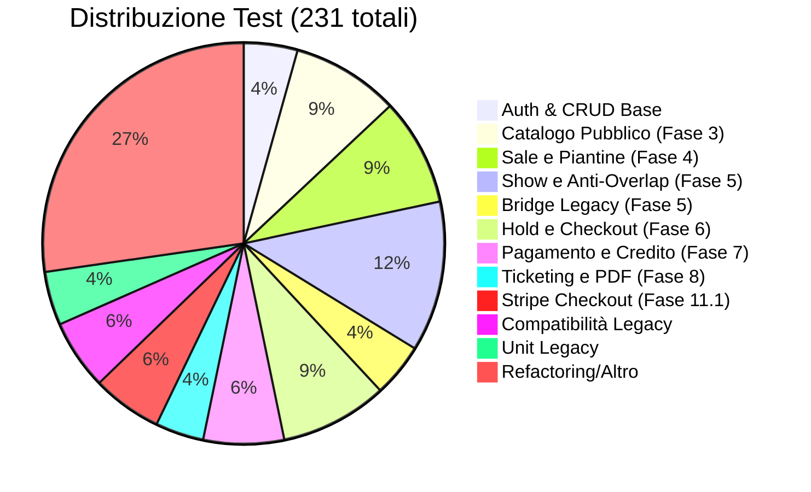
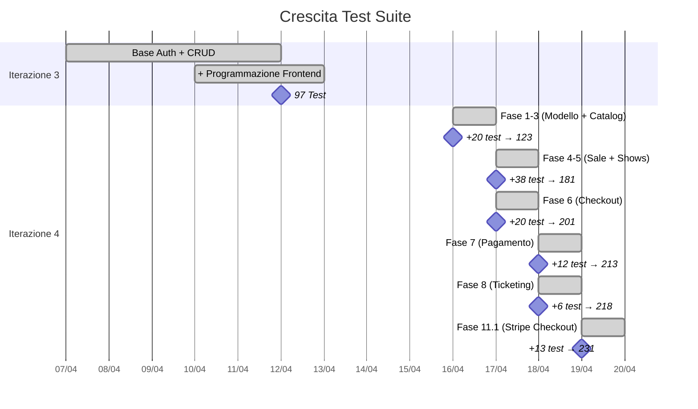

# Test Suite

## Panoramica

CineBase ha una suite di test di integrazione backend con **231 test** tutti verdi. I test coprono ogni fase dello sviluppo dalla Fase 1 alla Fase 11.1.

---

## Struttura dei Test

```
tests/backend/
└── FilmAPI.Tests/
    ├── Integration/
    │   ├── ApiIntegrationTests.cs           # CRUD base + auth
    │   ├── ProgrammazioneIntegrationTests.cs # Catalogo pubblico
    │   ├── SalaIntegrationTests.cs           # Sale e piantine
    │   ├── ShowIntegrationTests.cs           # Show e anti-overlap
    │   ├── ProiezioneCompatIntegrationTests.cs # Bridge legacy
    │   ├── CheckoutIntegrationTests.cs       # Hold e ordini
    │   ├── PagamentoCreditoIntegrationTests.cs # Pagamento e credito
    │   ├── TicketIntegrationTests.cs         # Biglietti e PDF
    │   ├── ValidazioneTicketIntegrationTests.cs # Validazione
    │   ├── CheckoutHostedIntegrationTests.cs # Stripe Checkout
    │   └── CustomWebApplicationFactory.cs    # Infrastruttura test
    └── Unit/
        └── ProiezioneServiceTests.cs        # Test unitari legacy
```

---

## Distribuzione Test per Area



---

## Evoluzione Test per Iterazione



---

## Infrastruttura di Test

### `CustomWebApplicationFactory`

```csharp
public class CustomWebApplicationFactory : WebApplicationFactory<Program> {
    protected override void ConfigureWebHost(IWebHostBuilder builder) {
        // Usa database InMemory di EF Core
        builder.UseSetting("DB_CONNECTION_STRING",
            "Data Source=:memory:;");

        // Sostituisce servizi reali con Fake
        builder.ConfigureServices(services => {
            // Stripe: fake gateway
            services.AddScoped<IStripeGateway, FakeStripePaymentGateway>();

            // Email: fake service
            services.AddScoped<IEmailService, FakeEmailService>();

            // TMDB: fake client
            services.AddScoped<ITmdbService, FakeTmdbService>();
        });
    }
}
```

### Fake Stripe Gateway

Il `FakeStripePaymentGateway` simula l'intera pipeline Stripe:
- Creazione PaymentIntent e Checkout Session
- Webhook `checkout.session.completed`, `expired`, `payment_intent.*`
- Controllo stato sessione per reconcile
- Idempotenza

### Fake Email Service

Per i test di ticketing, l'email service è sostituito con un'implementazione fake che verifica:
- Che la chiamata sia stata effettuata
- Che il PDF sia stato allegato

---

## Esempi di Test (Checkout)

```csharp
// Test di concorrenza: hold stesso posto da due utenti
[Fact]
public async Task CH16_Concorrenza_Hold_Stesso_Posto_Solo_1_Vince() {
    var (client1, _) = await CreateAuthenticatedUserAsync("user1@test.it");
    var (client2, _) = await CreateAuthenticatedUserAsync("user2@test.it");

    // Task 1: utente 1 tenta hold posti [1,2,3]
    var task1 = CreateHoldAsync(client1, showId, new[] { posto1.Id, posto2.Id, posto3.Id });

    // Task 2: utente 2 tenta hold posti [3,4,5] (posto3 in conflitto)
    var task2 = CreateHoldAsync(client2, showId, new[] { posto3.Id, posto4.Id, posto5.Id });

    await Task.WhenAll(task1, task2);

    // Solo uno dei due ha vinto posto3
    var result1 = await task1;
    var result2 = await task2;

    var posti1 = result1?.salaPostoIds ?? [];
    var posti2 = result2?.salaPostoIds ?? [];

    // Posto 3 deve essere in uno solo dei due hold
    Assert.True(
        (posti1.Contains(posto3.Id) && !posti2.Contains(posto3.Id)) ||
        (!posti1.Contains(posto3.Id) && posti2.Contains(posto3.Id))
    );
}
```

```csharp
// Test pagamento misto con Stripe Checkout
[Fact]
public async Task H7_Pagamento_Misto_Credito_Riservato_E_Carta_Stripe() {
    // Setup: utente con credito, ordine pending
    var (client, userId) = await CreateUserWithCreditAsync(20.00m);
    var order = await CreatePendingOrderAsync(client, holdToken);

    // Crea sessione Stripe con importoCreditoRichiesto=5.00
    var session = await CreateCheckoutSessionAsync(client,
        order.Id, metodoPagamento: "Misto", importoCreditoRichiesto: 5.00);

    Assert.NotNull(session?.stripeCheckoutUrl);
    Assert.NotNull(session?.stripeCheckoutSessionId);

    // Simula webhook completed
    await SimulateCheckoutCompletedAsync(client, session.stripeCheckoutSessionId);

    var ordineFinale = await GetOrdineAsync(client, order.Id);
    Assert.Equal("Paid", ordineFinale.stato);
    Assert.Equal(5.00m, ordineFinale.importoCredito);
    Assert.Equal(1.25m, ordineFinale.importoCarta); // 6.25 - 5.00
}
```

---

## Categorie di Test

### Test di Integrazione (221)
- CRUD completo per ogni entità
- Validazioni, conflitti, errori
- Flussi completi (acquisto → pagamento → ticketing)
- Webhook Stripe simulati
- Concorrenza e race conditions

### Test Unitari (10) — Ereditati
- Legati al vecchio modello `Proiezione`
- Mantenuti per compatibilità bridge legacy

### Test di Fumo/Manuali
- Invio email SMTP reale verificato
- Pagamento carta reale in test mode
- Flusso Stripe Checkout completo

---

## Comandi Esecuzione

```bash
# Esegui tutti i test
dotnet test tests/backend/FilmAPI.Tests.csproj

# Esegui con output dettagliato
dotnet test tests/backend/FilmAPI.Tests.csproj -v n

# Esegui test specifici
dotnet test tests/backend/FilmAPI.Tests.csproj --filter "CH16"

# Esegui con coverage
dotnet test tests/backend/FilmAPI.Tests.csproj -p:CollectCoverage=true
```

Output atteso:
```
Test run for /path/to/FilmAPI.Tests.dll (.NETCoreApp,Version=v8.0)
Microsoft (R) Test Execution Command Line Tool Version 17.*
Copyright (c) Microsoft Corporation.  All rights reserved.

Starting test execution, please wait...
A total of 231 test files matched the specified pattern.
[x] PASS  ApiIntegrationTests.R10 ...
[x] PASS  CheckoutIntegrationTests.CH16 ...
...
Test Run Successful.
Total tests: 231
     Passed: 231
 Total time: 45.2s
```
